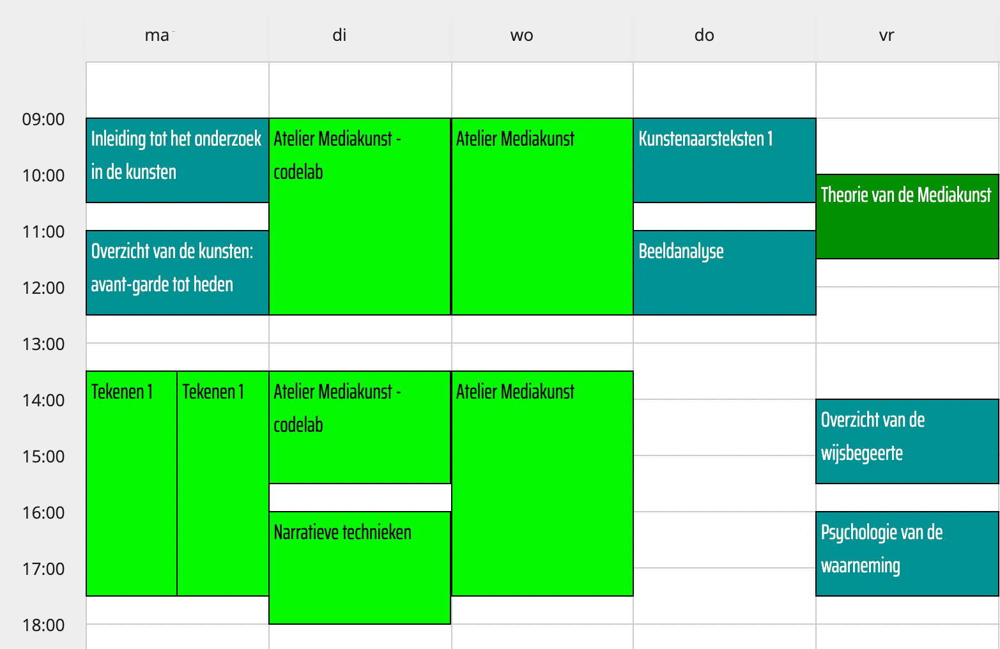
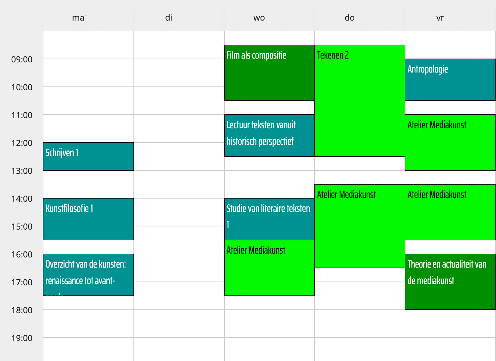
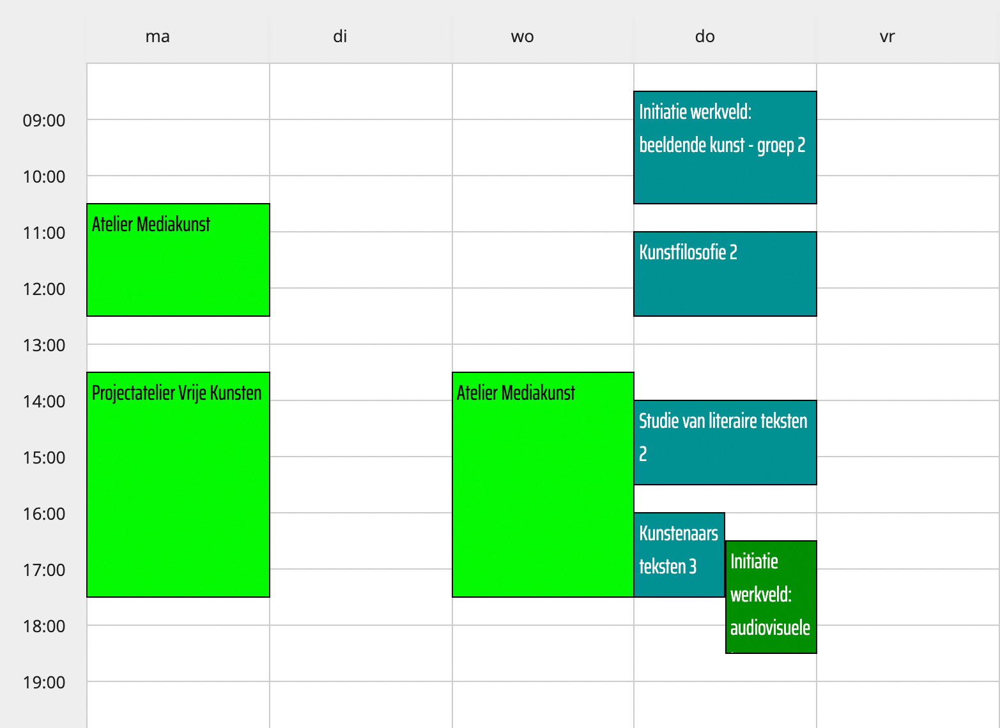
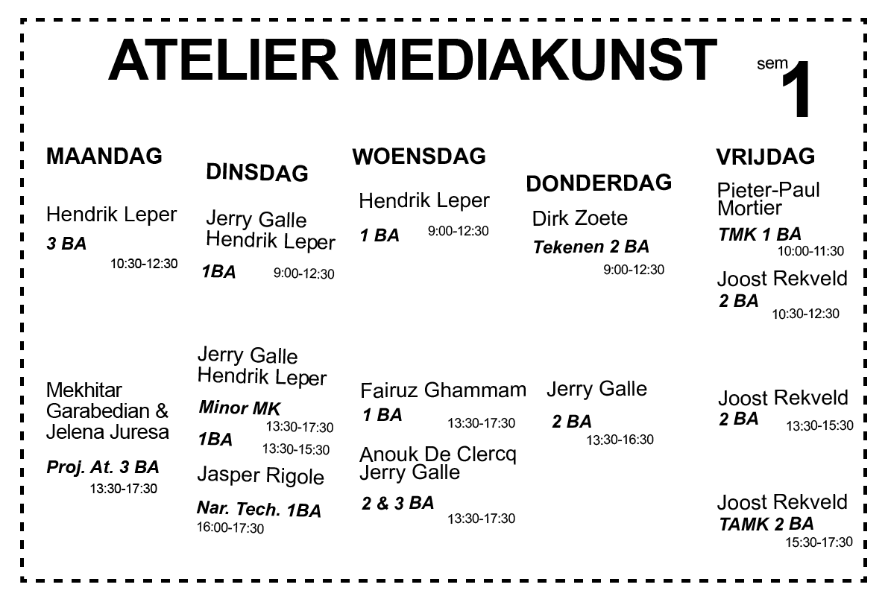

# PROGRAMMA / CURRICULA

## Curricula Mediakunst
[PDF met de curricula van de bachelor & master Mediakunst](http://docs.schoolofarts.be/documenten/Curricula%20beeldende%20kunsten/mediakunst.pdf)

## lessenrooster
**Persoonlijk rooster in Asimut**    
[ASIMUT LOGIN MET HOGENT-GEGEVENS](https://hogent.asimut.net/public/login.php?login-sso=true)    
[Handleiding voor Asimut](https://schoolofartsgent.be/assets/files/paginas/files/Asimut_gebruikershandleiding.pdf)    

**Overzichtsrooster 1e bachelor**

**Overzichtsrooster 2e bachelor**

**Overzichtsrooster 3e bachelor**

## Atelierrooster
of een rooster met de aanwezigheid van docenten doorheen de week.    

## Studiefiches
[link](https://www.hogent.be/studiefiches/) naar alle fiches van alle opleidingen School of Arts Gent.

###  1e bachelor
* [Atelier mediakunst I](https://bamaflexweb.hogent.be/BMFUIDetailxOLOD.aspx?a=128852&b=5&c=1)
* [Atelier mediakunst II](https://bamaflexweb.hogent.be/BMFUIDetailxOLOD.aspx?a=128853&b=5&c=1)
* [Atelier narratieve technieken](https://bamaflexweb.hogent.be/BMFUIDetailxOLOD.aspx?a=128680&b=5&c=1)
* [Tekenen 1](https://bamaflexweb.hogent.be/BMFUIDetailxOLOD.aspx?a=128834&b=5&c=1)
* [Theorie van de Mediakunst](https://bamaflexweb.hogent.be/BMFUIDetailxOLOD.aspx?a=128740&b=5&c=1)

### 2e bachelor
* [Atelier mediakunst III](https://bamaflexweb.hogent.be/BMFUIDetailxOLOD.aspx?a=128854&b=5&c=1)
* [Atelier mediakunst IV](https://bamaflexweb.hogent.be/BMFUIDetailxOLOD.aspx?a=128855&b=5&c=1)
* [Tekenen 2](https://bamaflexweb.hogent.be/BMFUIDetailxOLOD.aspx?a=128835&b=5&c=1)
* [Film als compositie](https://bamaflexweb.hogent.be/BMFUIDetailxOLOD.aspx?a=140689&b=5&c=1) (voorheen Post-narratieve Strategieën)
* [Theorie en Actualiteit van de Mediakunst](https://bamaflexweb.hogent.be/BMFUIDetailxOLOD.aspx?a=128738&b=5&c=1)

### 3e bachelor
* [Atelier mediakunst V](https://bamaflexweb.hogent.be/BMFUIDetailxOLOD.aspx?a=128850&b=5&c=1)
* [Atelier mediakunst VI](https://bamaflexweb.hogent.be/BMFUIDetailxOLOD.aspx?a=128851&b=5&c=1)
* [Dossier](https://bamaflexweb.hogent.be/BMFUIDetailxOLOD.aspx?a=128709&b=5&c=1)

### Master Vrije Kunsten / Fine Arts
* [Masterproef vrije kunsten deel 1](https://bamaflexweb.hogent.be/BMFUIDetailxOLOD.aspx?a=132030&b=5&c=1)
* [Masterproef vrije kunsten deel 2](https://bamaflexweb.hogent.be/BMFUIDetailxOLOD.aspx?a=131412&b=5&c=1)
* [Scriptie vrije kunsten](https://bamaflexweb.hogent.be/BMFUIDetailxOLOD.aspx?a=131421&b=5&c=1)
* [Masterclass Vrije kunsten](https://bamaflexweb.hogent.be/BMFUIDetailxOLOD.aspx?a=131433&b=5&c=1)
* [Kunst in het werkveld](https://bamaflexweb.hogent.be/BMFUIDetailxOLOD.aspx?a=131944&b=5&c=1)
