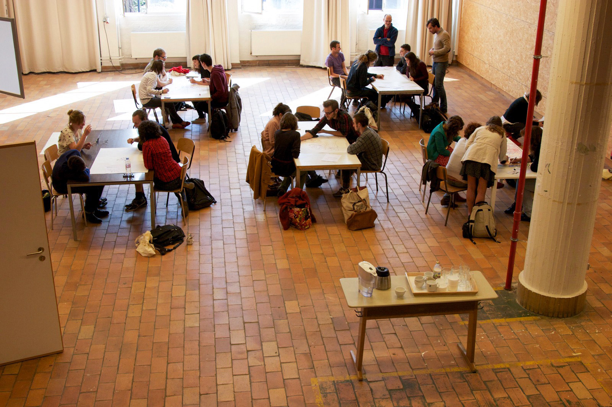
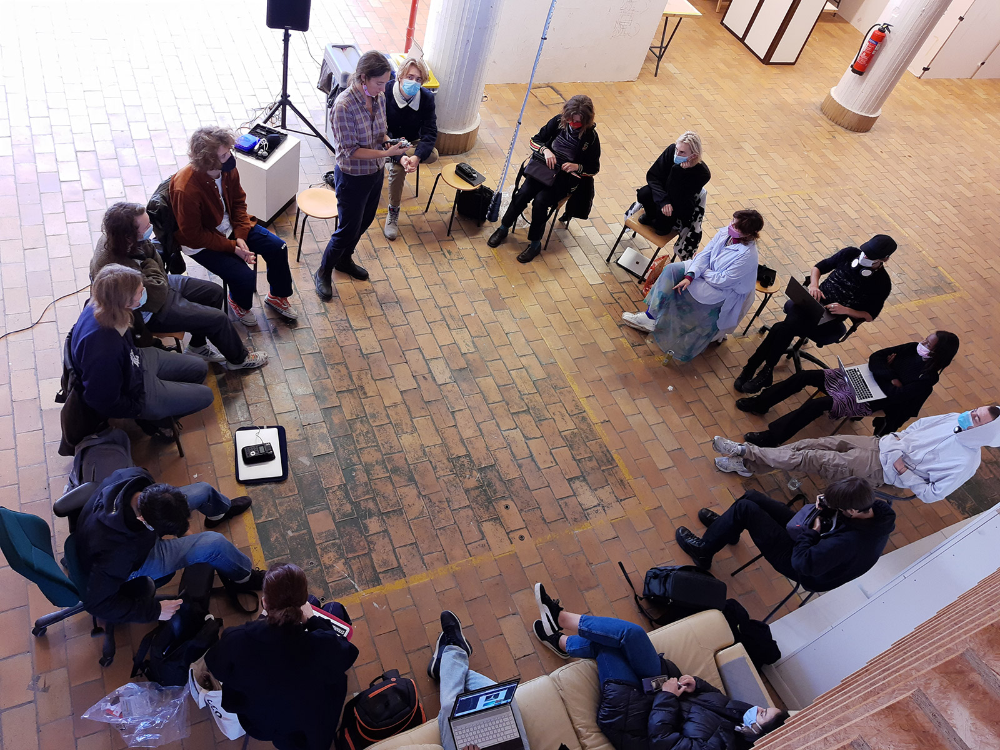

# ATELIER

Het atelier mediakunst is een plaats voor educatie, creatie en productie. Deze eerste verdieping van de Kunsttoren werd zo'n 10 jaar terug in gebruik genomen en evolueert met de opleiding mee. Het is een werkplaats met een aantal gespecialiseerde werkruimtes voor o.a. videomontage, audio en muziek, VR, AI, elektronica, een blackbox & daglicht presentatieruimte en de 2 onderzoek labo’s: [Formlab](https://www.formlab.schoolofarts.be/) en [Laboratorium](http://laboratorium.bio/).

## ☞ [faciliteiten](faciliteiten)

Het atelier is leer- en werkplaats die zelf ook dagelijks wordt gevormd en onderhouden door ons, gebruikers, docenten, onderzoekers en studenten. Daarom deze oproep! Waaraan je ook werkt, wat je ook doet, Mediakunst, het traject en het atelier, kan het alleen mogelijk voor jou maken, als jij het ook mogelijk maakt voor mediakunst. Mediakunst is er voor jou en jij bent er voor mediakunst. We sluiten niets en niemand uit, in plaats daarvan moedigen we verschillen in middelen, capaciteiten, interesses, achtergronden en kennis juist aan. Alle studenten en personeelsleden dragen bij aan de cultuur van zorg op deze school.

## ☞ [gedragscode](gedragscode)
