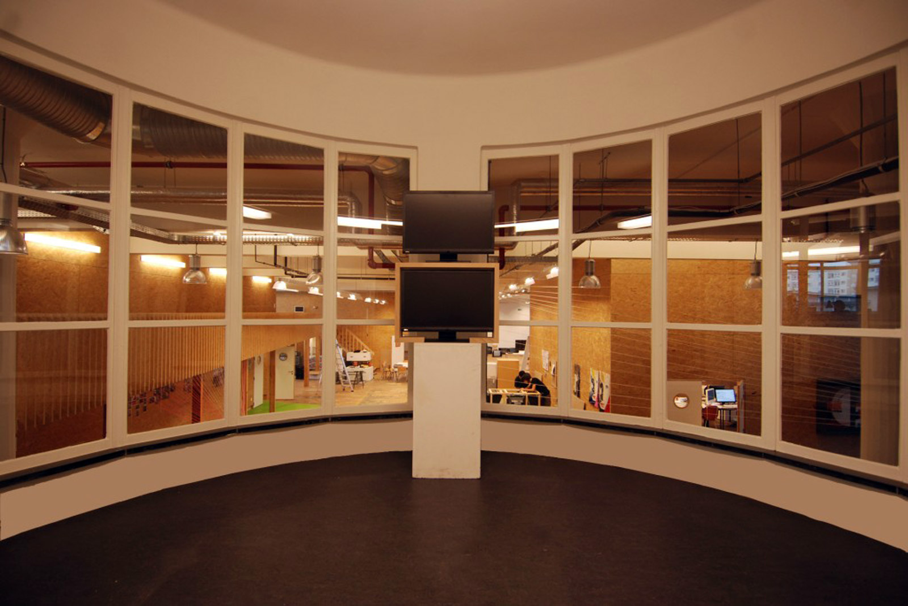
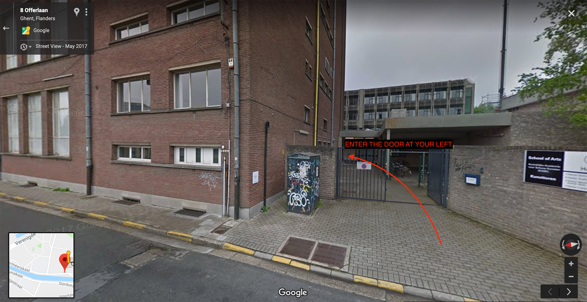
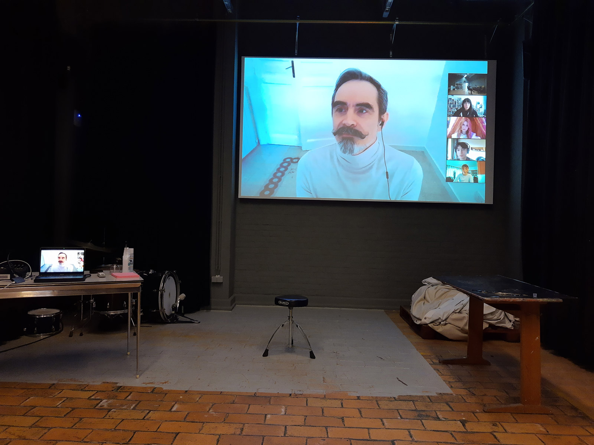
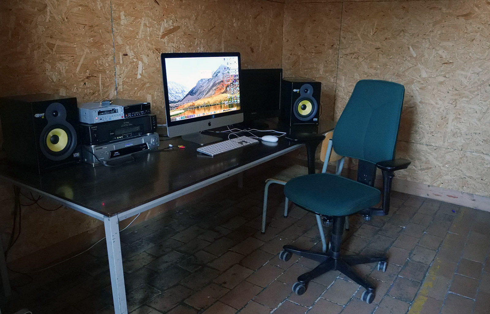
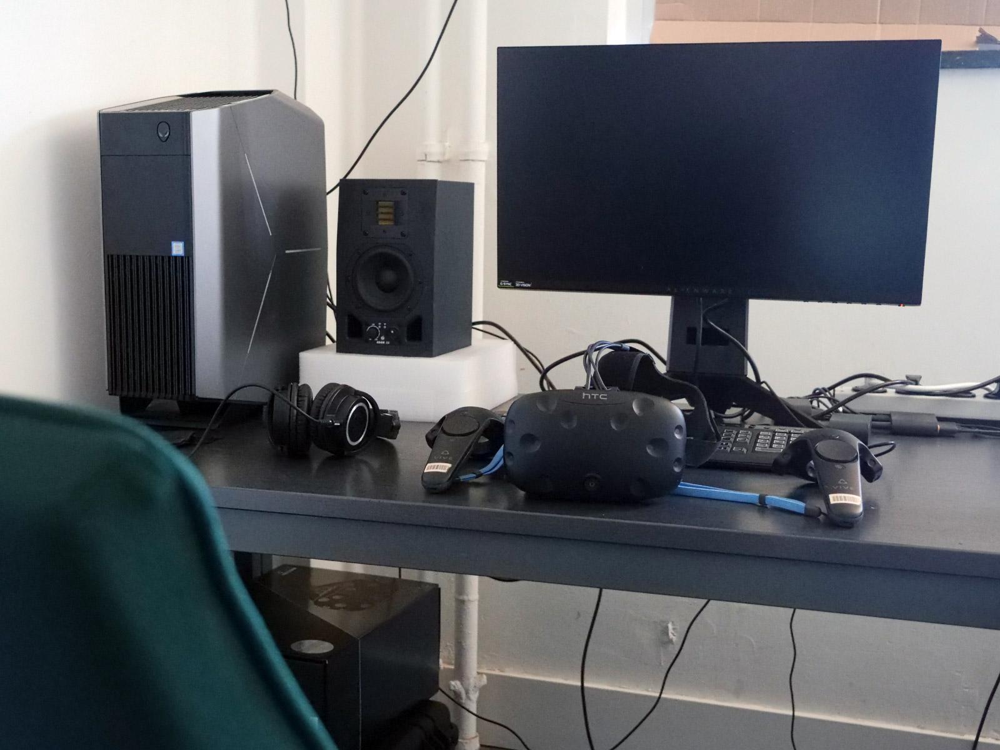
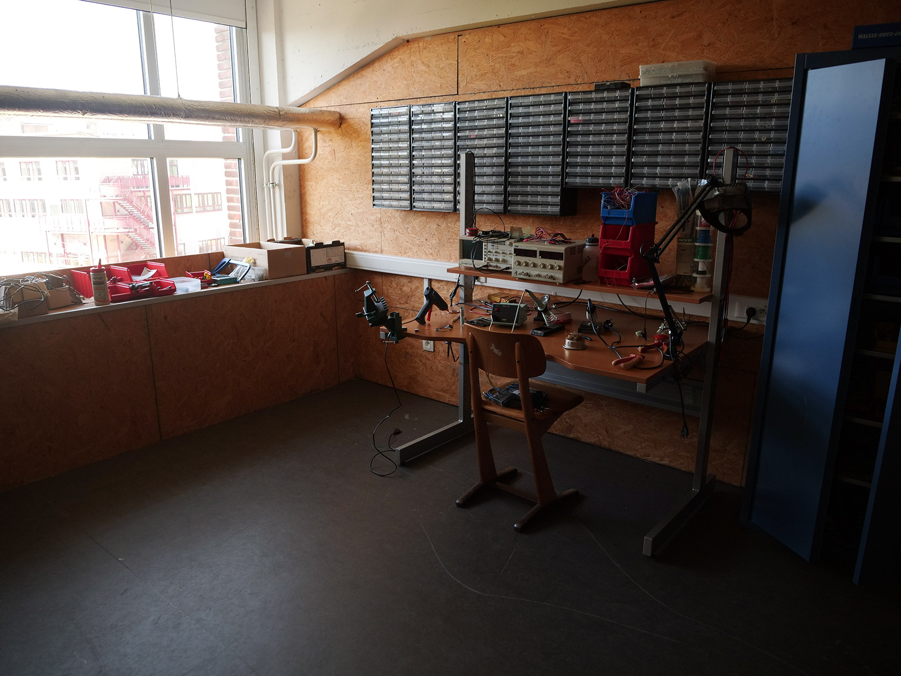
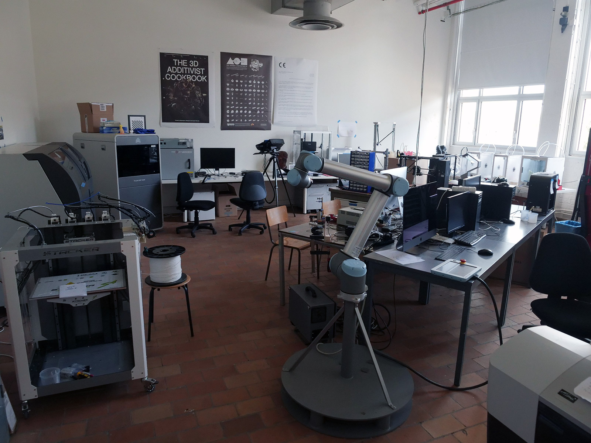
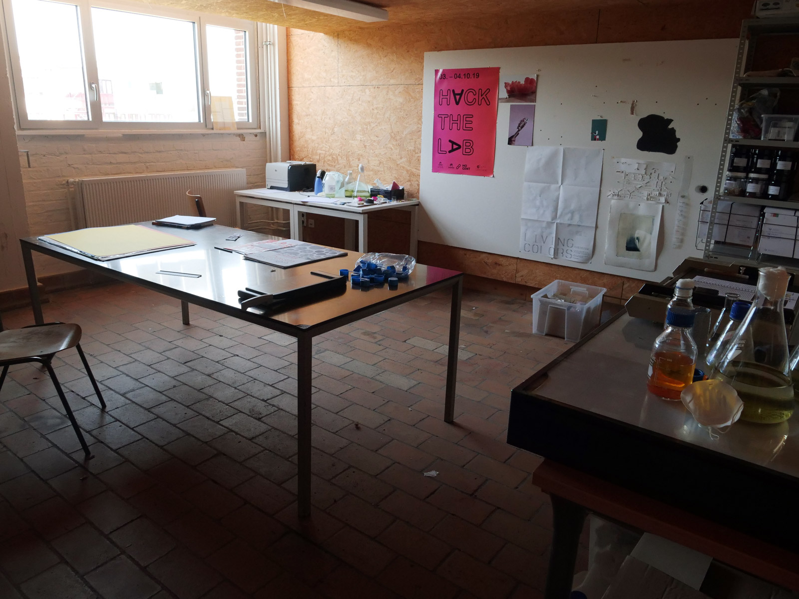

## FACILITEITEN

### Atelier
Het atelier mediakunst bevindt zich op de 1e verdieping van de Kunsttoren. De oorspronkelijke functie van het gebouwd was een textielschool, iets dat zich nog nog erg duidelijk laat zien in de architectuur.     

#### Adres
Offerlaan 5    
9000 Gent    
[kaart](https://www.google.com/maps/dir//Offerlaan+5,+9000+Gent/@51.0442882,3.7048299,987m/data=!3m1!1e3!4m8!4m7!1m0!1m5!1m1!1s0x47c37166edf87939:0x9204369e1efa3c9f!2m2!1d3.7092073!2d51.0442883?hl=nl) & [bereikbaarheid](https://schoolofartsgent.be/nl/over-ons/locaties/campus-bijloke-de-kunsttoren#campus-bijloke-de-kunsttoren)

#### Openingsuren
Tijdens het academiejaar is de Kunsttoren doorgaans open van ma-do 8:00 - 22:00 & op vr 8:00 - 18:30. Tijdens het weekend is het gebouw gesloten.

Er kan een uitzondering op deze reguliere openingsuren worden aangevraagd via de coördinator van de opleiding.

Alle campussen en gebouwen zijn gesloten tijdens het kerstreces en het zomerreces van midden juli tot midden augustus.

#### Ruimtes Reserveren
Je kan dagdelen reserveren in de verschillende gedeelde gespecialiseerde ruimtes als de daglicht presentatieruimte in het atelier, de Blackbox, Videomontage ruimte, Audiolab en VRlab. Voorlopig gebeurt het reserveren ter plaatse via een kalender.

#### Beheer en Zorg
**Respecteer ruimtes & middelen.** Hou materialen, gereedschap en ruimtes beschikbaar. Zet alles na gebruik terug op de juiste plaats.    
**Laat geen sporen na. **Laat de gedeelde ruimtes proper achter. Sporen zijn ongewenste of ongevraagde materiële of immateriële achterblijfsels. In je eigen werkruimte, op je eigen computer ben je baas zolang het veilig en hygiënisch blijft.    
**Draag zorg voor eigen en uitgeleend materiaal.** We beschouwen het atelier graag als een veilige plaats maar dat is het spijtig genoeg niet. Laat dus nooit waardevolle zaken achteloos achter. Maak gebruik van de locker.    
**Draag zorg voor je files** Je kan files achterlaten op de gedeelde computers maar ze staan daar nooit 100% veilig. Zorg steeds voor een backup.     
**Open en afsluiten van ruimtes.** Via de studenten- of personeelskaart (of een salto sleutelhanger) kunnen de ruimtes geopend en gesloten worden. Maak daar gebruik van zodat.    

### Blackbox
De Blackbox is een polyvalente ruimte die gebruikt wordt voor screenings, lezingen, groepsgesprekken en atelier specifieke theorielessen. Studenten kunnen in deze plek ook opstellingen en performances oefenen en brengen, opnames maken, etc.

Afmetingen: ±11 bij 6 meter & 5,5 meter hoog.    
Akoestische geoptimaliseerd met absorberende panelen en gordijnen.    
video: [Panasonic PT-RZ470E](https://nl.business.panasonic.be/visual-system/sites/default/eu-files/visual-systems/files/technical_downloads/PT-RZ470E_E.pdf) projector (led/Laser DLP-projector)    
geluid: [Yamaha STAGEPAS 400BT](https://usa.yamaha.com/files/download/other_assets/1/1142301/stagepas_600bt_en_om_c0.pdf) PA systeem (2 x 200watt, 8-channel mixer, Bluetooth, ...)    
Er is in het atelier nog een 2e PA systeem voorhanden bestaande uit 2 [QSC K10.2](https://www.qsc.com/resource-files/productresources/spk/k.2/q_spk_k2_usermanual.pdf) actieve speakers (Multi-purpose, 2-way active loudspeaker, 2000 Watt Class-D amp, 10inch woofer).    
licht: dimbare TL lampen & puntspot op spreker via schakelaar (Q1)

### Videomontage
De Videomontage ruimte is uitgerust met een krachtige Apple computer, een 2e beeldscherm en studiomonitors. Qua software is zowel een videopakket van Adobe met recente versies van Premiere Pro en After Effects geïnstalleerd als Apple Final Cut Pro en DaVinci Resolve van Blackmagic.    

Computer: Apple iMac 27" (3,8‐GHz 8‐core Intel Core i7-processor, 32Gb Ram, Radeon
Pro 5700 XT met 16GB Ram  grafische kaart, AZERTY toetsenbord)    
`user: schoolofarts – psw: 1111`    
Tweede scherm: Sony (type ??)    
Geluid: KRK 6 Rokit studio monitors

### Audio lab
De audio werkplaats uitgerust met een Apple iMac computer, quadrofone luidspreker opstelling, een analoge synth van Doepfer. Qua software is er Ableton Live, Adobe Audition, Reaper & Max geïnstalleerd.

Computer: Apple iMac 27" (AZERTY toetsenbord) + RME Fireface geluidskaart    
`user: schoolofarts – psw: 1111`    
Geluid: Quadrofoon opstelling met 4 Adam T7V studio monitors, Adam T10 subwoofer, Mackie mixer    
Instrumenten: Doepfer Modulaire synth (type ??), Koma (type ??)    
Software licenties: Max op iLok usb key. Er is geen Ableton Live.

### VR lab
! verder uitschrijven
Blender, Unity, Unreal, Adobe Premiere Pro en After Effects

Computer: Dell Alienware Aurora R10 (AMD Ryzen™ 9 5900X 12C, 32Gb Ram, NVIDIA® GeForce RTX™ 3090 24GB grafische kaart, AZERTY toetsenbord)     
`user: schoolofarts – psw: 1111`    
VR headsets:
Geluid: Adam ?? studio monitors

### Elektronica Lab
! verder uitschrijven

Arduino's, Raspberry Pi's 3B en 400, Pico
### AI
! verder uitschrijven
Linux computer met GTX grafische kaart, ...

### keuken
! verder uitschrijven

### Formlab
[Formlab](https://www.formlab.schoolofarts.be/) is een werkplaats die inzet op het overbruggen van het digitale naar het fysieke. Centraal staat het 3D-printen en -scannen maar er zijn ook mogelijkheden om te frezen en vacuümvormen.

### Laboratorium
[Laboratorium](http://laboratorium.bio/) is een experimenteel lab voor kunst/design en biotechnologie. Het organiseert workshops, lezingen en participeert in het academisch programma van KASK binnen de thema's als kleuren, biomaterialen, Art+Science en DIYbio.

