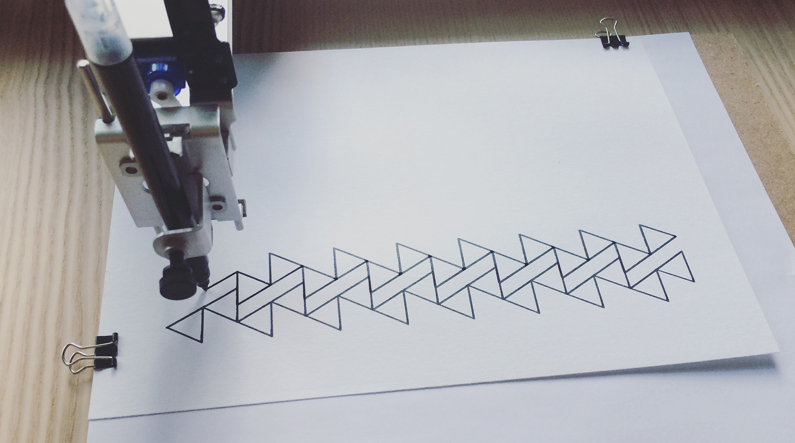
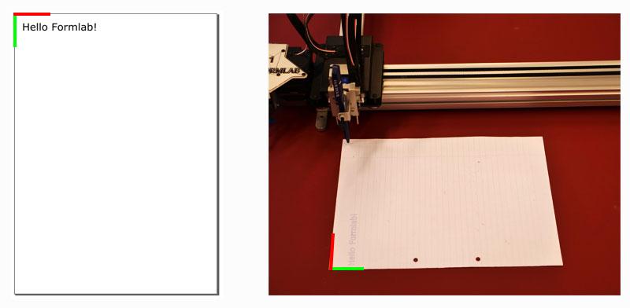
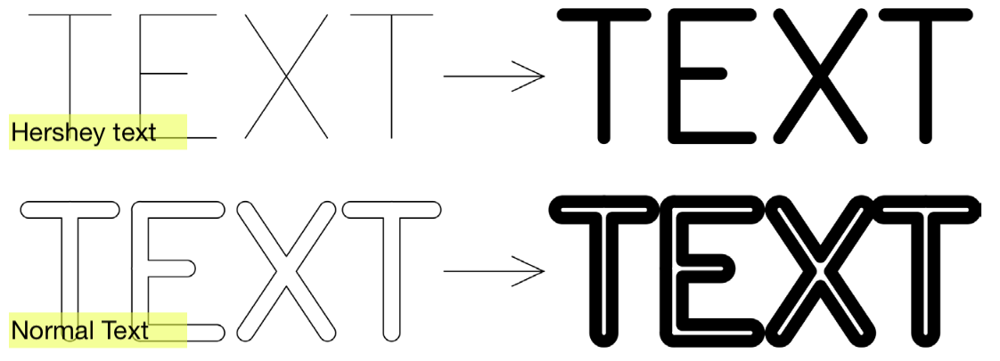
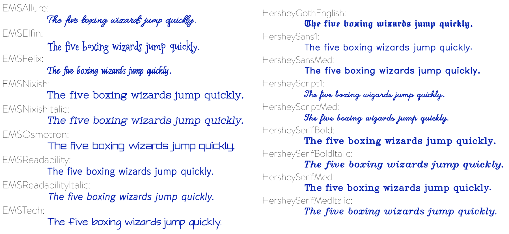
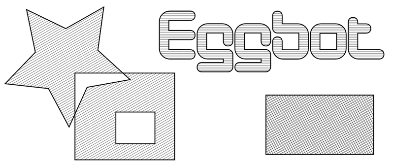

# PEN PLOTTER FUN
**with [AxiDraw V3/A4 & A3](https://AxiDraw.com/) – an A3 pen plotter from Evil Mad Scientist**    
    

A pen plotter is a type of simple robot. It guides a pen (or other implement mounted in the pen holder) along the set of vector lines, curves, and paths that you (through a computer) ask it to follow.
This is much like using a traditional printer, except that you need to take care that your documents are made of paths, rather than pixels.

## AxiDraw User Guide
[pdf user guide for the AxiDraw V3 family](https://cdn.evilmadscientist.com/dl/ad/public/AxiDraw_Guide_v501b.pdf)

## Using AxiDraw with Inkscape
#### ☞ [Software Installation](https://wiki.evilmadscientist.com/AxiDraw_Software_Installation)
#### ☞ Quick Setup
1. Check which AxiDraw plotter you have. Is it an A4 or an A4 model? Based on that, you need to do some settings differently.
2. Move the AxiDraw to its Home Corner.
3. Plug in power and USB cables.
4. Add the pen to the plotter.
5. Position your paper with its upper-left corner below the pen tip.
6. In Inkscape
  1. Set pagesize to **A4** or **A3** Landscape in File -> Document Properties.
  2. Select the drawing or text and select Path -> Object to path (possibly optional).
  3. Extensions -> AxiDraw Control. Go to tab setup. Click the Toggle pen between UP, DOWN option. Click apply to toggle the pen down and back up to check the correct vertical movement.
    1. Adjust the pen's height
    2. Try to keep the range of movement to a minimum. This will draw faster and is better for the servo motor.
  4. Select the right plotter. Extensions -> Options -> Config. For the A4 model choose **AxiDraw V2 or V3**. For the A3 model choose **AxiDraw V3/A3 or SE/A3**.
  5. Extensions -> AxiDraw Control. Go to tab Plot and click Apply to start plotting. Each visible layer will print.

#### Additions
1. **Vertical documents** in Inkscape will be rotated left 90° on the AxiDraw:    

For **single line fonts**, check Inkscape Extensions -> text -> Hershey text. [More info here](https://cdn.evilmadscientist.com/dl/ad/public/HersheyText_v30r5.pdf)    
    
    
To **fill shapes** with lines or hatches, check Inkscape Extensions -> text -> Hatch Fill. [More info](https://wiki.evilmadscientist.com/Hatch_fill).    

## Using AxiDraw without Inkscape
* [AxiDraw Python API](https://AxiDraw.com/doc/py_api/) for plotting files and XY movement commands
* [Driving the AxiDraw from within Processing](https://github.com/evil-mad/AxiDraw-Processing)
* [more](https://wiki.evilmadscientist.com/AxiDraw#Third-party_software_to_drive_AxiDraw:)

## Bitmap 2 Vectors
Convert JPG, PNG images to SVG, PDF, EPS, AI.    
Pen plotters can only draw lines, typically in a single color, so getting them to reproduce a photograph is difficult. This page collects some ideas for how to plot images that are represented as a grid of colors, or a [raster](https://en.wikipedia.org/wiki/Raster_graphics).

#### ☞ In Illustrator
1. Place Image in Illustrator.
2. Select the image and Image Trace  (Object -> Image Trace) or open the Image Trace window.
3. Try some presets. Remember that the plotter can only draw the outline (stroke) of a path it cannot fill a shape.
4. Click expand to complete the Vectorization .

#### ☞ In Inkscape
1. Open Image in Inkscape. Open image in Inkscape or drag an image onto your Inkscape document.
2. Trace Bitmap (Path -> Trace Bitmap) Then, hover over Path in the top Inkscape toolbar and click on Trace Bitmap. ...
3. Complete the Vectorization.
See also [this tutorial](https://inkscape.org/doc/tutorials/tracing/tutorial-tracing.html)

#### ☞ with [Plotter Fun](https://mitxela.com/plotterfun/) – a playground for plotter art
Different algorithms all collected in a very handy Webapp by [Mitxela / Tim Alex Jacobs](https://mitxela.com/). See [this page](https://mitxela.com/projects/plotting) for more info on the algorithms etc.    
More options [here](https://mattwidmann.net/notes/plotting-raster-images/)

## Drawing by Numbers / Generative Art 4 plotters
#### [Turtle Graphics](https://en.wikipedia.org/wiki/Turtle_graphics)
turtle graphics are vector graphics using a relative cursor (the "turtle") upon a Cartesian plane (x and y axis).    
The turtle has three attributes: a location, an orientation (or direction), and a pen. The pen, too, has attributes: color, width, and on/off state (also called down and up).    
The turtle moves with commands that are relative to its own position, such as "move forward 10 spaces" and "turn left 90 degrees". The pen carried by the turtle can also be controlled, by enabling it, setting its color, or setting its width.

[A turtle graphics module for Python](https://docs.python.org/3/library/turtle.html)    
[A minimalistic javascript Turtle graphics API](https://turtletoy.net/)

#### [P5.JS](https://p5js.org/)
A JavaScript library for creative coding, with a focus on making coding accessible and inclusive for artists, designers, educators, beginners, and anyone else!
#### [Processing](https://processing.org/)
a flexible software sketchbook and a language (Java) for learning how to code within the context of the visual arts.
#### [Nodebox](https://www.nodebox.net/)
a node-based software application for generative design. It's built from the ground up by designers to be easy-to-use, efficient, and fast.
#### & many more

## READS & LINKS
* Pierre Paslier started the website [Generative Hut](https://www.generativehut.com/), a journey into pen plotting & creative coding with lots of practical information, tutorials, etc.
* Tobias Toft [An intro to Pen Plotters](https://medium.com/quarterstudio/an-intro-to-pen-plotters-29b6bd4327ba)
* Matt DesLauriers [Pen Plotter Art & Algorithms](https://mattdesl.svbtle.com/pen-plotter-1)
* Michael Fogleman [Pen Plotter Programming: The Basics](https://medium.com/@fogleman/pen-plotter-programming-the-basics-ec0407ab5929)
* Tyler Hobbs [9 Tips to Execute Generative Art with a Plotter](https://tylerxhobbs.com/essays/2018/executing-generative-art-with-a-plotter)
* Anders Hoff [On Generative Algorithms](https://inconvergent.net/generative/)
* ...

## ART
* [Lia](https://www.liaworks.com/) is a Austrian. She is one of the pioneers of software and net art and has been producing works since 1995. Her practice spans across video, performance, software, installations, sculpture, projections and digital applications. These are a collection of [plotter drawings](https://www.liaworks.com/tag/plotter-drawing/)
* [Patrick Tresset](https://patricktresset.com/) (Fr) is a Brussels based artist who develops performative art installations with robotic agents as stylised actors. [video](https://www.youtube.com/watch?v=gG_pzgfeESs)
* [Sougwen Chung](https://sougwen.com/) is a Chinese-born, Canadian-raised artist. Her work explores the mark-made-by-hand and the mark-made-by-machine as an approach to understanding the interaction between humans and computers. [Video](https://player.vimeo.com/video/228868235)
* [Jürg Lehni](http://juerglehni.com/) is a Swiss designer / artist / technologist. His works often take the form of platforms and scenarios for production, such as the drawing machines [Hektor](http://juerglehni.com/works/hektor), [Rita](http://juerglehni.com/works/rita), [Viktor](http://juerglehni.com/works/viktor) & [Otto](http://juerglehni.com/works/otto).
* Some pioneers of generative / computer (& plotted) art are: [Manfred Mohr](http://www.emohr.com/), [Georg Nees](http://dada.compart-bremen.de/item/agent/15), [William Kolomyjec](http://dada.compart-bremen.de/item/agent/644), [Vera Molnar](http://dada.compart-bremen.de/item/agent/14), [Frieder Nake](http://dada.compart-bremen.de/item/agent/68) & [many more](http://dada.compart-bremen.de/browse/artwork?filter_type=item_type&filter_value=drawing)
