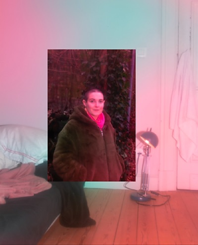
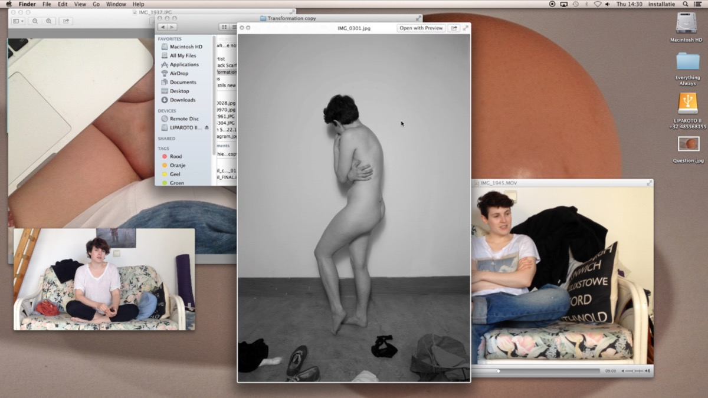
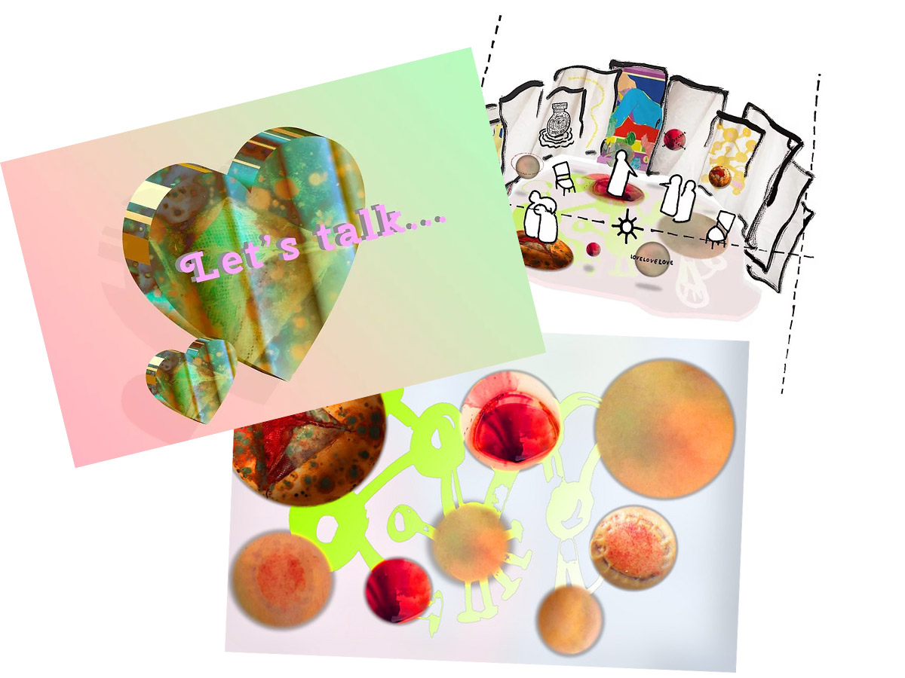

# AAY LIPAROTO
#### artist presentation & studiovisits
#### atelier MEDIAKUNST / KASK
#### vrijdag, 18 februari 2022, 10:30
A. Liparoto (1987, USA) was educated in Visual Arts in London and completed a MFA at KASK Ghent in 2015.

    

Aay Liparoto traverses the boundaries of intimacy and bureaucracy. Seeking tenderness with your identity card and the bureaucracy implicit in your friendships. Their work touches on stories of everyday relationships with objects, people and social structures, whose power can be rendered invisible by daily interaction. Each governed by layers of laws, nostalgia and social history.

In their solo and collaborative practice Liparoto uses repetitive performative acts and creates scenarios along with workshops, videos and text to audiovisually unpick these everyday life relationships. This methodology began with the 9 month long daily performance project *Andrew has His Period* (2014) and *Andrew a Strong Courageous Warrior* (2016) a seductive reflection on normative gender performance. Evolving further on a road trip across the USA with their mirror image to understand the nature of collaboration in *We were Fools for Thinking it was going to be Fun* (2019). Then in *all bodies welcome| no bodies welcome* (2020), they question the need for queer bodies to consent online with the an immersive co-written choral installation created in collaboration with HOT BODIES – Choir Brussels.

During their recent residency at [Morpho](https://www.morphovzw.be/) (2021/2022), Antwerp they are developing *Small acts of Violence*, a new piece produced by ARGOS (Brussels). It relies on researches on the perpetration of non-consensual violence by women, non-binary and non-cis men in intimate relationships. Resulting is a haptic 360° cinematic virtual reality installation, that osmotically subverts sensuality, tenderness and institutions. Asking what are the violent actions we take in the name of love?

#### 10:30-12:00	Artist Presentation
For an hour and a half, Aay takes us on a journey through their artistic practice, themes, processes, and ideals.
#### 13:30-17:00	Studiovisits
Engage with Aay in a one-on-one conversation about your work. Sign up through [this doodle](https://doodle.com/poll/qe86r4hh5xxysw9z?utm_source=poll&utm_medium=link).

