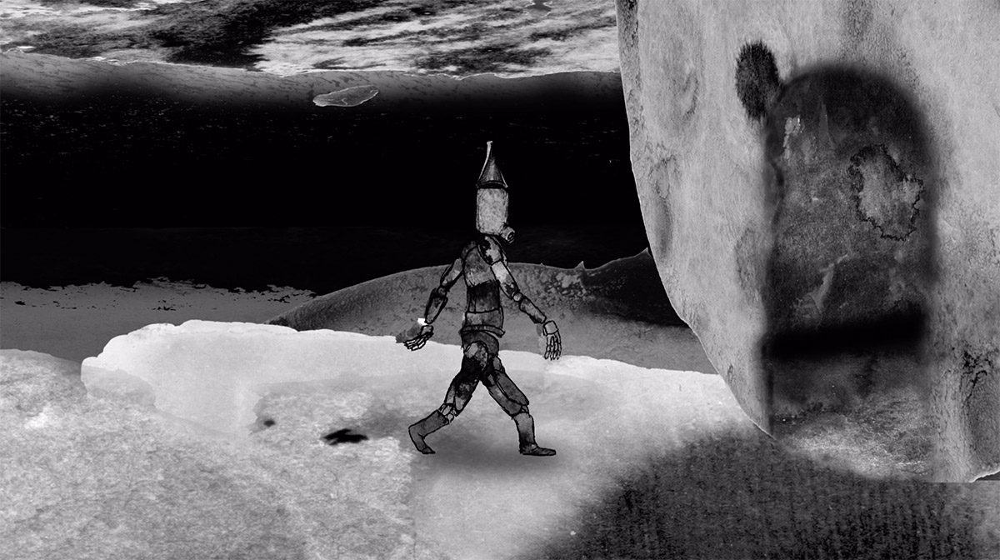

# AFTER EFFECTS
#### dinsdag, 15 & 22 februari 2022, 9:00 - 12:30
[Adobe After Effects](https://www.adobe.com/be_nl/products/aftereffects.html) is een toepassing voor visuele effecten, motion graphics en compositing. Het wordt gebruikt in het postproductieproces van films, videoproducties, videogames, animatie, …  De workshop wordt gegeven door Quirijn Dees, student animatiefilm.

Tijdens de workshop zullen zowel de basisprincipes als de algemene workflow van het programma worden behandeld. Deze kennis is toepasbaar in het gebied van digitale animatie, videomontage en post-productie.

De workshop zal in grote lijnen gaan over:
* De algemene workflow en interface van AE
* Compositing
* Animatie (2D en 2,5D)
* Video-editing en effecten
* Organisatie en opzet van een project in AE

Naast een uitleg over deze onderwerpen, zullen de deelnemers ook actief kunnen participeren aan de hand van kleine opdrachtjes.

    

**Quirijn** is een student in het tweede jaar bachelor van animatiefilm. Hij begon met animeren tijdens zijn vorige opleiding Sonologie in Den Haag, een studie die zich vooral richt op experimentele elektronische muziek en geluid. Het was tijdens deze opleiding dat Quirijn’s interesse in audiovisuele kunst hem dreef om in After Effects digitale cut-out en 2,5D animatie te maken.
