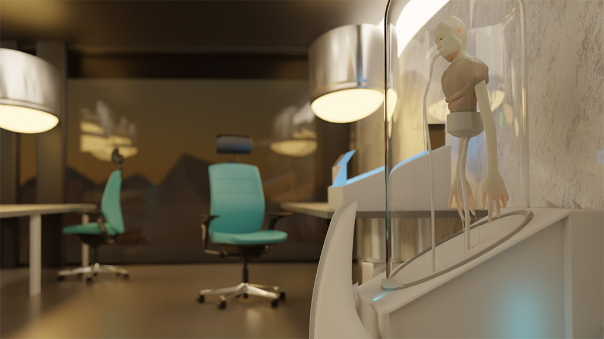

# WORKSHOP BLENDER
### 3D modeling, sculpting, shading & rendering
Blender is een krachtig, gratis en open source, 3D-modeling software pakket dat wordt gebruikt voor animatie, video games, data visualisaties of het ontwerpen van objecten voor digitale fabricage.

Tijdens deze praktijk gerichte workshop zal Fons Artois je een inleiding geven in de basisprincipes en de mogelijkheden van Blender!

De workshop is bedoeld voor zowel beginners als ervaren gebruikers. De eerste 3uur van elke workshop sessie zijn steeds op instap niveau en volgen op elkaar. Het vierde uur van elke sessie is er individuele begeleiding en kunnen ook de meer gevorderden hun projecten en eventuele issues voorleggen. ​​

    

Enige voorkennis in Blender en 3D modeling is niet vereist, maar als je je inschrijft verwachten we wel dat je elke sessie aanwezig  bent.

De deelnemers zorgen zelf voor een (recente) laptop met [Blender](https://www.blender.org/download/) versie 2.93 (minimum) reeds geïnstalleerd + een muis met een scrollwiel dat kan ingedrukt worden!!! Het is erg belangrijk dat je op voorhand test of de software werkt zodat er niet nodeloos tijd verloren moet worden. In de installatie niet verloopt zoals moet kan je met ons contact opnemen.

De workshop kan in het Engels gegeven worden.

## PROGRAMMA
#### woensdag 1/12/21 9:00-12:30, Atelier Mediakunst   
User Interface +  modeling 3D + sculpting
#### woensdag 8/12/21 9:00-12:30, Atelier Mediakunst   
sculpting, shading + rendering

## DEELNEMEN
Mail hendrik.leper-at-hogent.be

    

## FONS ARTOIS
Fons Artois is alumni media art. His graduation project [Tools for Animals](https://graduation.schoolofarts.be/student/fons-artois/) is a speculative open source design project looking at how we can better arm animals against humans.  Fons has interests in: Ecofuturism, Bio-Art and posthumanist literature. He is currently giving workshops and working on a sci-fi adventure game: "SOURCE".
