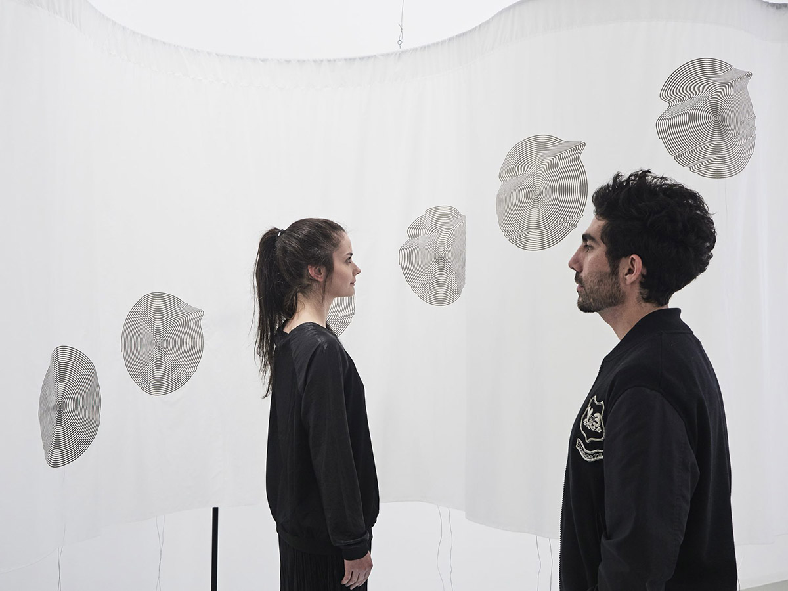
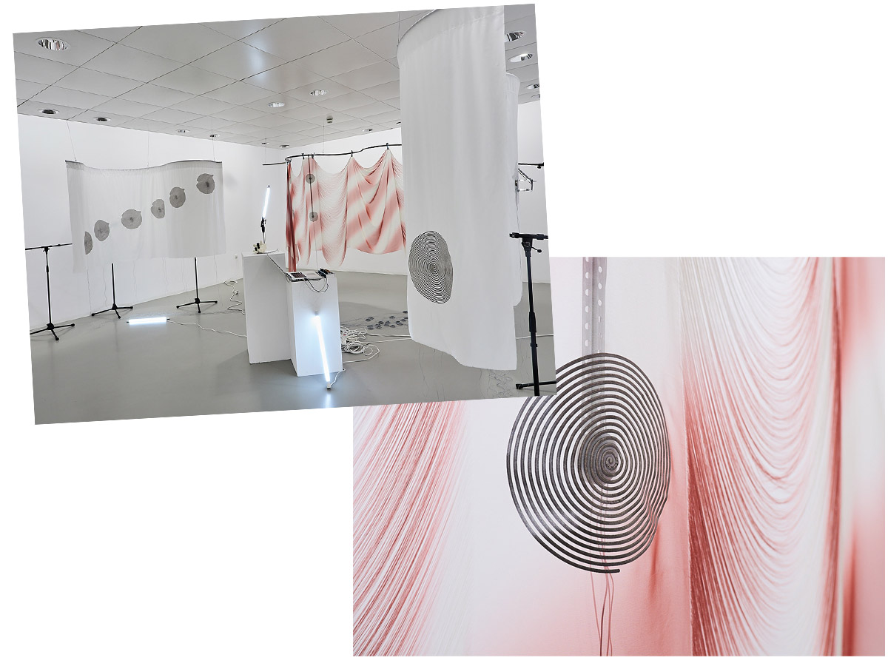

# SOFT RESONANCE
#### Artist Presentation & workshop with EJ TECH
#### KASKcinema & FILM studio
#### 21/03/22 20:00, 22 & 23/03/2022 10:00 - 18:00
Under the label [EJTECH](https://ejtech.studio/), Esteban de la Torre and Judit Eszter Kárpáti combine their know-how. Esteban de la Torre is a media artist, sound artist. Judit Eszter Kárpáti is an interdisciplinary artist, textile artist and material researcher.

EJTECH /’eitech’/ is a polydisciplinary studio working with unstable media, experimental interfaces, electronic textile and augmented materials. Textile, sound, light, and space are paramount elements in their practice. EJTECH works as a tool to investigate liminal states, notions of time, and the state of presence, using technological methods as active, participatory installations or multi-sensorial performances within their self proclaimed technospiritual tradition.

#### Monday 21 March 20:00, Artist Presentation @ KASKcinema
Judit Eszter Kárpáti and Esteban de la Torre take us on a journey through their artistic practice, themes, processes, and ideals.

masterclass is free. Sent an email to raf.enckels[at]]hogent.be to register.

#### Tuesday 22 & Wednesday 23 March 10:00 - 18:00,	Workshop @ Film studio
During a two day Hands-on workshop participants get to work with a modular textile sound system setup.

The workshop starts with a a brief theoretical introduction and a short performance on the core principles and common uses of spatial sound, translated to the expressive and unique timbre of textile.

Participants will gain knowledge of the anatomy of a soft speaker vs a regular speaker, uses and sound system implementations. Practical work on the onsite system, focused on experimentation, allowing participants to freely explore under guidance into multichannel sound, feedback, sound sources in motion and delve into the physical force of sound and cymatics.

We will be working under concepts inspired by [Bernhard Leitner](https://www.bernhardleitner.at/en)’s sound/body/space works, participants are invited to think of space as a fundamental building block in a sonic experience.

workshop: 40€ for kask students (possibly payed by the studio). Sent an email to raf.enckels[at]hogent.be & hendrik.leper[at]hogent.be to register.

In collaboration with [Overtoon](https://www.overtoon.org/) & [EPAS](https://www.epasound.org/)
