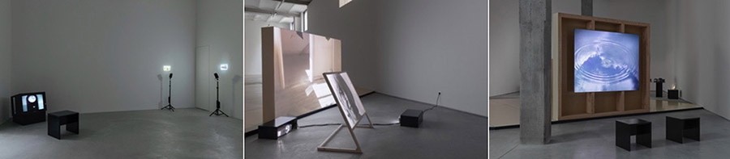

# ELEPHY
#### masterclass
#### atelier Mediakunst + Harlan Levey Projects 1080 Brussels
#### Thursday, 10/02/2022 10:00-18:00 + Friday, 11/02/2022, 10:00-13:00

[elephy](https://elephy.org) is a Brussels-based production and distribution platform for film and media art founded by four KASK alumni – Rebecca Jane Arthur, Chloë Delanghe, Eva Giolo and Christina Stuhlberger – in 2018. Elephy supports its productions by providing them with an artist-run, professional framework which ensures that they can be made with the greatest artistic freedom.

### Program
#### Thursday, 10/02/2022 10:00-18:00 - atelier mediakunst
On 10 February, Rebecca Jane Arthur and Eva Giolo of elephy will visit KASK Media Arts to discuss their collective endeavours and autonomous practises with you. They will present their platform and its activities, opening up production and distribution case studies of varied scales and funding routes; inform of residencies and funding opportunities that have helped them on their way since graduation; and discuss how they work together both inside and alongside elephy.    

Further opening up their own artistic practises and processes with you, Arthur and Giolo will present their recently co-authored publication, BE GOOD, IF YOU CAN’T BE GOOD, BE GOOD AT IT Boom Boom Boom Boom (2021), and the films that developed alongside the writing of the book, A tongue called mother and Liberty: an ephemeral statute.

#### Friday, 11/02/2022, 10:00-13:00 - Harlan Levey Projects 1080, Brussels
On 11 February, the artists invite you to visit elephy’s group exhibition, [Laying Bricks](https://hl-projects.com/events/10/), at Harlan Levey Projects 1080 in Brussels, with a guided tour of the show and to join them in conversation on group presentation, display, and exhibition production.

### Participate
The masterclass can accommodate 20 students. You can register for both days separately or, preferably, for the whole trip. Please subscribe using [this form](https://forms.office.com/r/LJj2EnFQdB).
