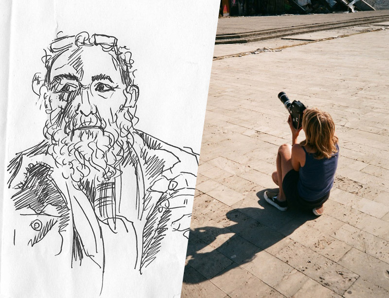
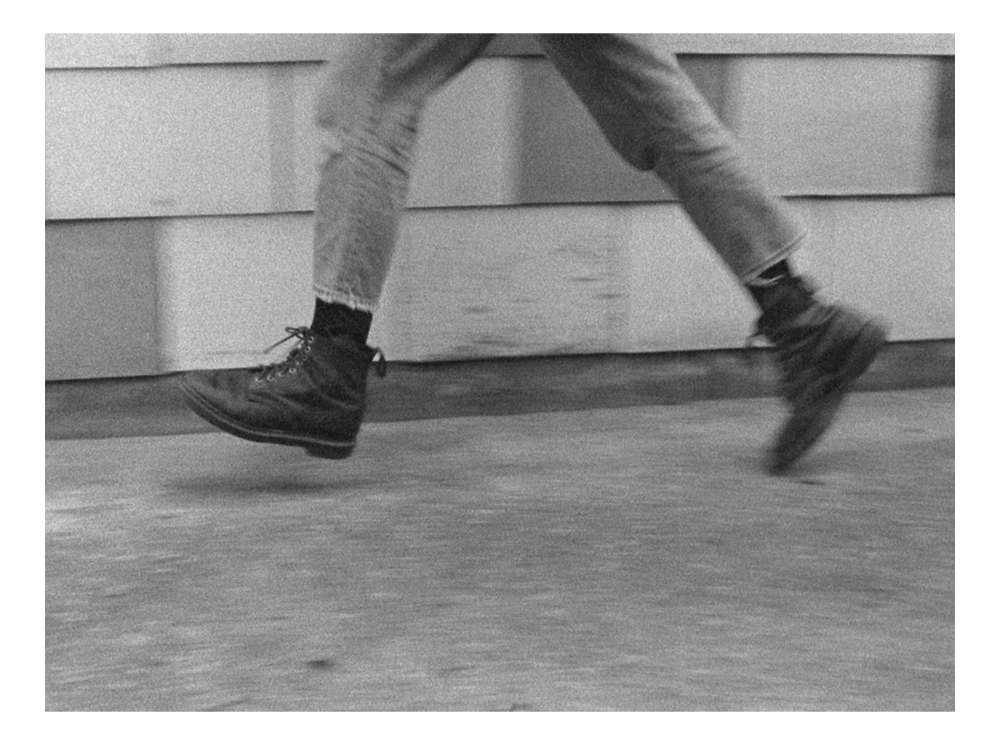
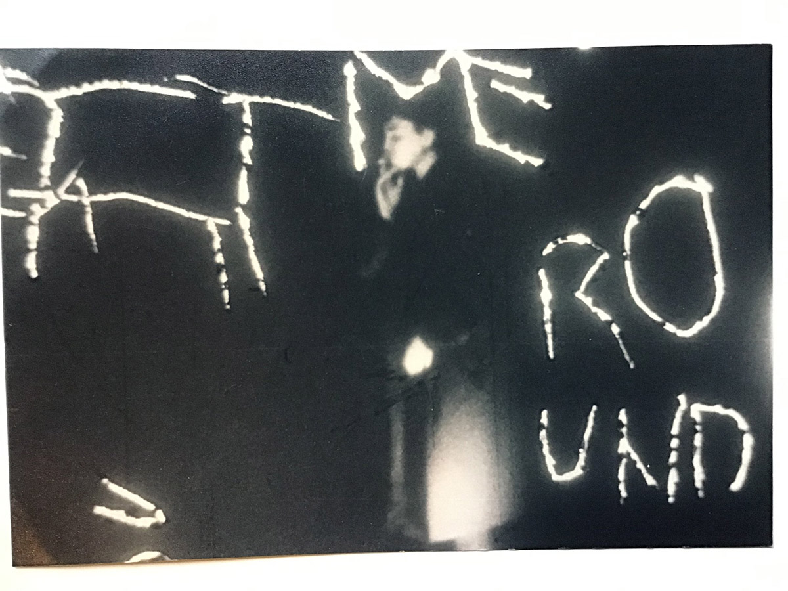

# EVA CLAUS & MARCUS BERGNER
#### artist presentations, screenings & studiovisits
#### MEDIAKUNST studio
#### Friday, 25 February 2022, 10:30
[Eva Claus](https://www.evaclaus.com/) (1992 Brussels) is an audio-visual artist working primarily with 16mm film. Her practice is driven by observations of (un)expected encounters with landscapes and people, natural habitats, circularity and means of film itself. Eva´s films exhibit a contemplative form of watching. In her recent films she uses an intuitive method of filmmaking in which she shares her interest in minimal narration.
Eva was educated at the Friedl Kubelka School for independent film in Vienna, Austria and she obtained her MFA at KASK in Ghent. Her films have been shown at festivals such as Light Field San Francisco, International Film Festival Rotterdam, Moscow International Film Festival, Process Film Festival Riga, Harkat Festival Mumbai, Rencontre International Paris / Berlin and Istanbul International Film Festival, amongst others.    

Marcus Bergner is an Australian artist and filmmaker based in Brussels. He is a member of [the Post Collective](https://post.opendesigncourse.be/) and the sound poetry group [Arf Arf](http://oralsite.be/pages/Clanguage).    
A reoccurring focus to much of Marcus Bergner’s artworks and related research has been in shifting and rethinking points of intersection that operate between/within the worlds of visual art, literature, art history, film, and performance. As part of these investigations he has made over 25 experimental films that have been exhibited in solo and group exhibitions/screenings in museums, galleries and cinemas across Australia, Europe and North America. These films are divided into three distinct lines of production: language/poetry, spatial/performance, and visual art areas. Between 1985 and 2000 as a member of the Australian sound poetry group Arf Arf, Bergner performed extensively throughout Australia and Europe.

#### 10:30-12:00	Artist Presentations & Screenings
Eva will start the presentation by showing some of her films on 16mm. Afterwards, she will take us through her artistic evolution, working methods and elaborate on working with analogue film as a filmmaker, projectionist and restorer for Robert Beavers.    
    

Marcus will show us two movies:    
**Musical Four Letters** (16mm, 6mins, colour, sound, 1989)    
Every conceivable word with four-letters that has anything to do with music (including melodious bodily functions and swear words) has been written directly onto the surface of a 1940s Mexican musical film. Words reveal an innately fictive capacity for abstraction and offer an escape route for memory.     
**Angledozer** (16mm, 16mins, sound, colour, 1996)    
A film collage using an optical printer and various different film stocks to compose a metamorphosis of found imagery within architectural space. The soundtrack includes a live performance by Marisa Stirpe on jaw harp. Distributed by Light Cone, Paris and German Film Archives, Berlin.    
    

#### 13:30-17:00	Studiovisits
Engage with Eva in a one-on-one conversation about your work. Sign up through [this doodle](https://doodle.com/poll/umhvzu2a5sq4u585?utm_source=poll&utm_medium=link).
