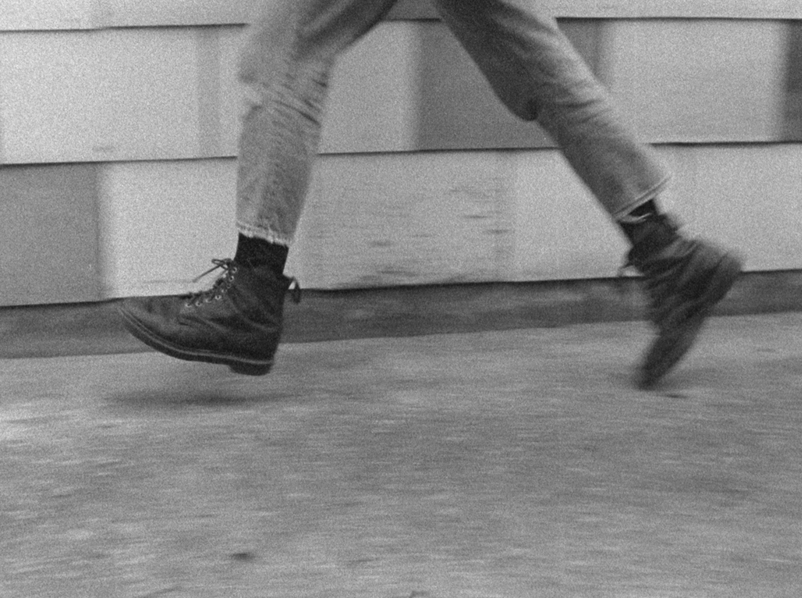

# EVA CLAUS
#### artist presentation & studiovisits
#### atelier MEDIAKUNST / KASK
#### vrijdag, 25 februari 2022, 10:30
[Eva Claus](https://www.evaclaus.com/) (1992 Brussels) is an audio-visual artist working primarily with 16mm film. Her practice is driven by observations of (un)expected encounters with landscapes and people, natural habitats, circularity and means of film itself. Claus´s films exhibit a contemplative form of watching. In her recent films she uses an intuitive method of filmmaking in which she shares her interest in minimal narration.

Claus was educated at the Friedl Kubelka School for independent film in Vienna, Austria and she obtained her MFA at KASK in Ghent. Her films have been shown at festivals such as Light Field San Francisco, International Film Festival Rotterdam, Moscow International Film Festival, Process Film Festival Riga, Harkat Festival Mumbai, Rencontre International Paris / Berlin and Istanbul International Film Festival, amongst others.

#### 10:30-12:00	Artist Presentation
Eva will start the presentation by showing some of her films on 16mm. Afterwards, she will take us through her artistic evolution, working methods and elaborate on working with analogue film as a filmmaker, projectionist and restorer for Robert Beavers.

#### 13:30-17:00	Studiovisits
Engage with Eva in a one-on-one conversation about your work. Sign up through [this doodle](https://doodle.com/poll/umhvzu2a5sq4u585?utm_source=poll&utm_medium=link).

The

