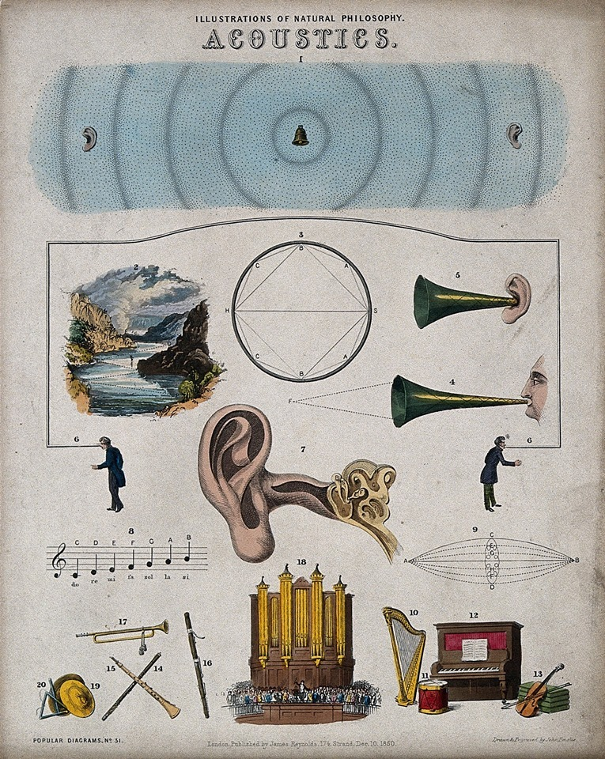

# KLANK IN RUIMTE
#### vrijdag, 12 & 26 feb. 2021
>Wie heeft nog nooit in de badkamer gezongen?    
Wie heeft nog nooit 'halo!' geroepen in de bergen of een tunnel?    
**Klank, ruimte en emotie zijn in een permanente wisselwerking.**

Tijdens deze workshop onderzoeken we hoe dit werkt.

Je mag je verwachten aan een geluidswandeling, iets over geluidsgolven en akoestiek.    
Hands-on gaan we aan de slag met luidsprekers. Hoe werken ze? Hoe stralen ze de klank af? Hoe werkt de kamer of zaal als filter? Hoe spreekt een werk optimaal?    
Er is ruim de mogelijkheid om je vragen en ideeën hierover te bespreken.    

Johan Vandermaelen werkt als geluidsscenograaf en werkt sedert geruime tijd samen met tal van Belgische en buitenlandse kunstenaars.

## Programma
#### Dag 1: GELUIDSWANDELING / GELUID & EMOTIE / GOLVEN & AKOESTIEK / SOUND AS A POT - SOUND AS FIELD
vrijdag 12/02/21 10:00-17:00, atelier Mediakunst
<!--
10u	inleiding
10u15	geluidswandeling, luisteren naar ruimtes
11u45	geluid en emotie (laag/hoog, baarmoeder, associaties) lezin kortrijk.

12u30	– 13u30 pauze

13u30	gedrag van golven / akoestiek
14u30 	luidspreker in ruimte (fase, kamfilter)
	worst cases
15u30 	Sound as a pot – sound as a field
16u30 	vraag en antwoord: cases van studenten

-->
#### DAG 2: GESCHIEDENIS VD LUIDSPREKER / LUIDSPREKERS BOUWEN / TYPES / TUNING
vrijdag 26/02/21 10:00-17:00, atelier Mediakunst
<!--
10u 	korte geschiedenis van de luidspreker
10u30	hoe werkt een luidspreker?
11u	Thiele/Small: wat is het? Wat vertelt het ons
11u15	luidsprekers bouwen
	–quick en dirty maquette-
	voorstelling project dipool/ open baffle

12u30 pauze

13u30	bouwen dipool / closed.
14u30 	plaatsing 4 dipool / 4 closed.
15u45	tuning
16u30	vraag en antwoord
-->
