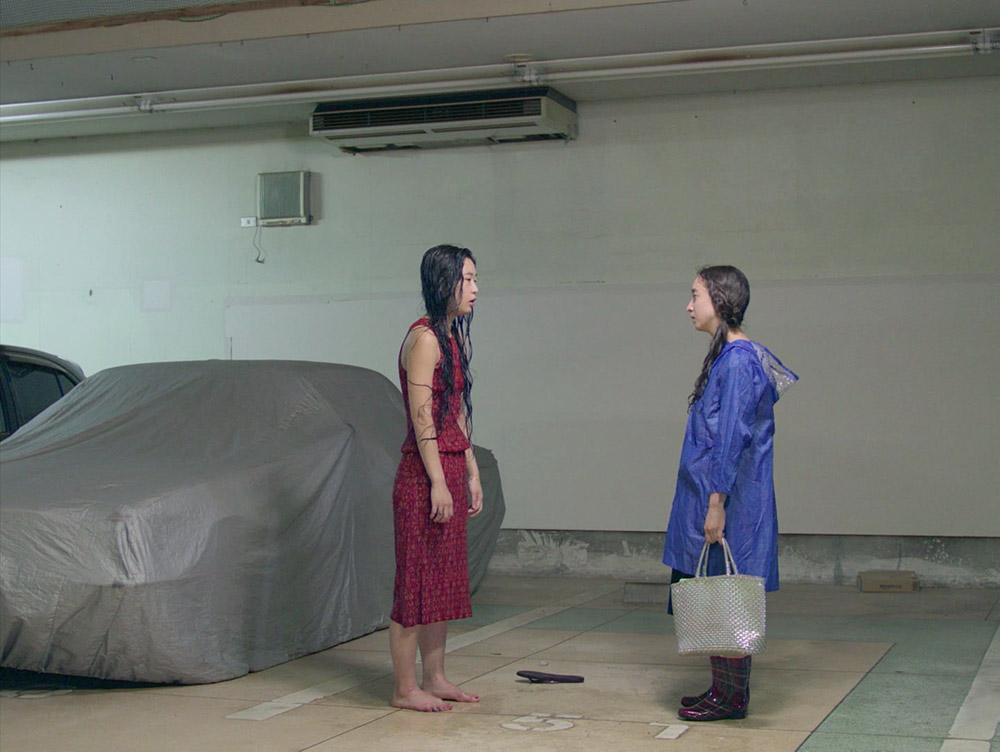

# LISA SPILLIAERT
#### Artist Presentation
#### Cirque KASK
#### woensdag 20 oktober, 2021, 16:00

[Lisa Spilliaert](https://www.lisaspilliaert.com), geboren uit een Japanse moeder en een Belgische vader, werd in 1990 in Tokio geboren en groeide daar op, maar verhuisde op haar zeventiende naar Brugge om haar opleiding in België verder te zetten. In 2013 behaalde ze een master in de fotografie aan KASK in Gent, de stad waar ze vandaag nog steeds woont en werkt. Ze gebruikt de zoeker van haar fototoestel en videocamera om een afstand te overbruggen, de persoonlijke dialoog tussen twee culturen vormt een rode draad doorheen haar fotografisch werk en haar films.

    
Tijdens de 20ste editie van het Courtisane festival presenteert Lisa Spilliaert haar eerste langspeelfilm N.P op zondag 24 oktober. In deze stille film, die zich afspeelt tijdens een Japanse zomer, ontdekken vier jonge mensen hoe één boek hen verenigt. Alle vier zijn ze gefascineerd door de roman N.P van de overleden, mysterieuze Sarao Takase. Deze gelijknamige film ontleedt het complexe web van relaties tussen de jonge personages. Hoe verhoudt een vertaling zich tot het origineel? Hoe verhoudt fictie zich tot de realiteit? En wat is de aard van de vaak incestueuze interacties tussen de hoofdpersonages?

Wij nodigen jullie graag uit voor een kunstenaarspresentatie / lezing die Lisa Spilliaert geeft op woensdag 20 oktober 16:00 > 17:30 in Cirque KASK op de Bijlokesite.
