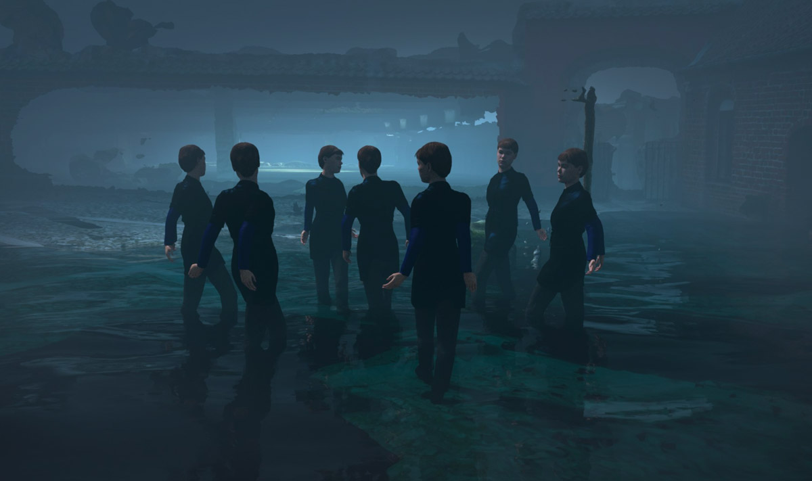
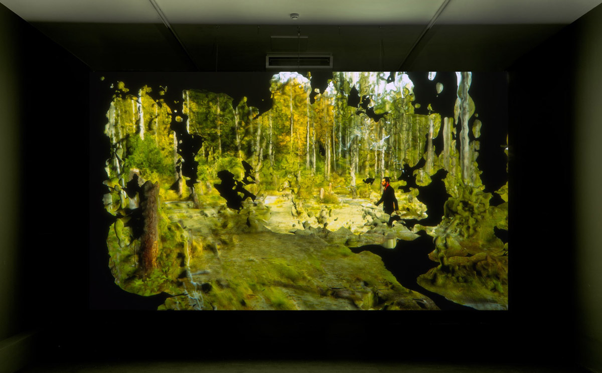

# MARGIT LUKÁCS & PERSIJN BROERSEN
#### artist presentation & masterclass
#### Blackbox MEDIAKUNST studio
#### 24/03/22 14:00, 2503/2022 10:00 - 17:00
[Margit Lukács and Persijn Broersen](https://www.pmpmpm.com/) are artists based in Amsterdam.     
With a plethora of technology that unceasingly quotes, references, embeds and re-tweets, the way stories are told has profoundly changed. Production and experience are increasingly blurred, propelling narratives to be continuously in flux and fluid. A perpetual resurrection that is either always becoming or, conversely, is becoming undone. Much of our practice is informed by these issues, deeply rooted in their interest in (the workings of) media, music and technology, intertwined with the politics of depicting nature, culled from political, mythological, musical, (art)historical, scientific and filmic sources. Whether created from intricate layers of cut-out photography, 3D-images, pieces of music, video sequences or CGI, their work reflects on authorship, the divide between perception and reality, and the social and political agency of the imaginary.

Their work, consisting of layered projections, digital animations and spatial installations, have been exhibited by institutions and organisations worldwide, amongst others at Centraal Museum (NL), HEK, Basel (CH), WROBiennale, Wroclaw (PL), ERESstiftung München (DE), Le Lieu unique, Nantes (FR), the Biennale of Sydney (Australia), Rencontres Arles (FR), Wuzhen Biennial Now Is The Time (CN), Stedelijk Museum Amsterdam (NL),  FOAM (NL), MUHKA (BE), Centre Pompidou (FR), Karachi Biennale, Karachi(PK), Kröller Müller (NL) and Casa Enscendida (SP). Our films have been shown at a.o. ARTE TV, Videomedeja, NoviSad (RS), Oberhausen Film Fest (GE), LAForum (US), Kassel Dokumentar und Filmfestival (GE), Rencontres Internationales Paris Berlin@Louvre Paris and Haus der Kulturen der Welt Berlin, the New York Film Festival (US), and the domestic festivals IDFA and IFFR.

    

#### Thursday 24 March 14:00, Artist Presentation @ Blackbox Mediakunst
Thursday afternoon, the duo will give a presentation on the evolution of their work and their most recent projects.
Their focus in recent years has consistently been on how our perception of nature is mediated and transformed through the use of digital technologies. They make videos, installations and objects. Recently they have also been working with composers and choreographers to integrate their input into a digital environment.

#### Friday 25 March 10:00 - 17:00, Masterclass @ Blackbox Mediakunst
On Fridays (morning and afternoon), the duo will engage in dialogue with your work. Each student receives individual attention, while the others can watch and listen along.

The presentation and masterclass are free. Sent an email to Robbe Vervaeke robbe.vervaeke@hogent.be and/or Hendrik Leper hendrik.leper@hogent.be to register.    
The presentation and masterclass can happen in Dutch or English depending on the participants.

    

In collaboration with animation film.
