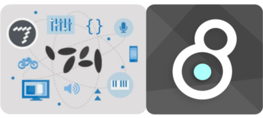

# MAX CODELAB
[MAX](https://cycling74.com/products/max) is [een visuele programmeer-omgeving](https://en.wikipedia.org/wiki/Visual_programming_language). Het programmeren gebeurt adhv visuele uitdrukkingen of ruimtelijke ordeningen van tekst en grafische elementen. Het programmeren in MAX heet **“patchen“**, visuele elementen of **“object boxes”** worden verbonden met draadjes of **“patchcords“**. Deze diagrammen laten zien hoe de data door het programma 'stroomt'. Met Max kan je onmiddellijk de resultaten zien en horen bij elke verandering die je maakt. Het is een heel intuitieve manier van programmeren waarin doen en denken kan samengaan.
    
MAX groeide over de jaren heen, het is onstaan midden de jaren 80, uit tot een erg uitgebreid en krachtig platform. Het wordt voornamelijk gebruikt door artiesten, componisten, wetenschappers, docenten, studenten en softwareontwerpers. Het voorziet in tools om te werken met midi, data, geluid en muziek **“msp~”**, bitmap beelden, video en 3D **“jitter”**, interactiviteit en connectiviteit met andere toepassingen en hardware ...

☞ [Made with MAX](https://cycling74.com/products/made-with-max) section on C74 website

Naast MAX zijn er nog heel wat andere visuele programmeer omgevingen. [Op deze pagina](https://github.com/ivanreese/visual-programming-codex/blob/master/implementations.md) vind je ze bijna allemaal opgelijst. Deze lijken me zeker het bekijken waard of vormen een mogelijk alternatief voor MAX.
* [Pure Data](https://puredata.info/) [Cross-platform] *Open source visual programming language for multimedia* [Purr Data](https://github.com/agraef/purr-data/releases) is de meest recente versie.
* [VVVV](https://vvvv.org/) [Win] *Hybrid visual/textual live-programming environment for easy prototyping and development*
* [TouchDesigner](https://derivative.ca/) [Mac, Win] *Visual development platform to create realtime projects*
* [NodeBox](https://www.nodebox.net/) [Mac, Win] * Cross-platform, node-based GUI for efficient data visualizations and generative design*
* ...

## INSPIRATIE
* AGF / Antye Greie-Ripatti / [Poemproducer](http://www.poemproducer.com/) uses language, sound, politics & explores speech within the audible depths of anti-rhythmic post-internet assemblages. [interview on C74](https://cycling74.com/forums/an-interview-with-antye-greie-ripatti-agf/), Song [my patch](https://www.youtube.com/watch?v=7o5pPcqcS_k) from the album Westernization Completed (2004).
* [Damian Taylor](https://www.damiantaylor.com/) | record producer, engineer, mixer, writer and programmer best known for his work with artists including The Prodigy, Björk, Arcade Fire, ...
* [Luke Dubois](https://lukedubois.com/) | American composer, performer, conceptual new media artist, programmer, record producer and pedagogue based in New York City.
* [AV3RY](http://www.av3ry.net/) | an AI musician, poet and visual artist created by [Alexander Schubert](http://www.alexanderschubert.net). Read more [here](https://cycling74.com/projects/av3ry)
* Timo Hoogland(http://www.timohoogland.com/) | Dutch livecoder, music technologist & educator.
* [Federico Foderaro](https://www.federicofoderaro.com/patches.html) | an audio-visual artist, media technologist, programmer and Max/MSP teacher.
* ...
