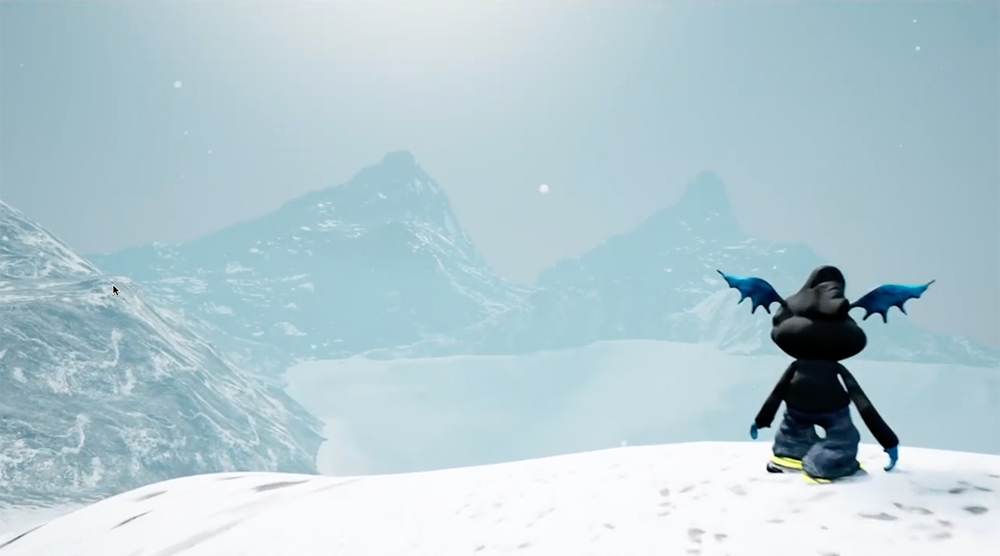

# NONGAMES
### Over gametech in de kunstpraktijk
#### met Quinten Vanagt, Lewi Moors & Lars Boelaerts
#### atelier Mediakunst
#### woensdag, 9/02/2022 15:00-16:30

[Quinten Vanagt](https://www.instagram.com/quinten2nite/) en [Lewi Moors](https://www.instagram.com/puss_99bb/) zijn master student Mediakunst / Vrije Kunsten. [Lars Boelaerts](https://www.instagram.com/larpiebabyomg/) passeerde hier ook even. Quinten, Lewi en Lars geven gedurende een uur en half een inkijk in hun artistieke praktijk, hun werkmethodes en de technieken en tools die het werk mogelijk maken. Vaak zijn dat tools die hun oorsprong kennen en gebruik hebben in de videogame industrie. We hebben het hier onder andere over Blender, Oculus Medium, Quixel, Mixamo en misschien nog het meest [Unreal Engine](https://www.unrealengine.com/), een erg populaire game engine ontwikkeld door de Epic Games studio.

    
Eind vorig jaar maakten ze samen een kortfilm **Rebooted Continuum**. Het verhaal in Rebooted continuum gaat over de avontuurlijke reis van LETO. In het begin lijkt LETO zijn omgeving niet te herkennen. Maar als we beter op zijn omgeving letten, zien we spoken en andere kopieën van LETO verschijnen die ons, en LETO doen beseffen dat het niet de eerste keer is dat hij door deze landschappen gaat.    
Hoe verder hij gaat, hoe meer hij geconfronteerd wordt met geesten van zijn vroegere reboot en op het einde komt hij vast te zitten in een soort hel. Kan hij ontsnappen uit dit Continuüm, of zal hij voor eeuwig en altijd vast blijven zitten in één van deze landschappen als één van de vele andere kopieën?

Je hoeft je niet in te schrijven voor deze lezing. Wees erbij en breng wat nieuwsgierigheid en vragen mee. 
