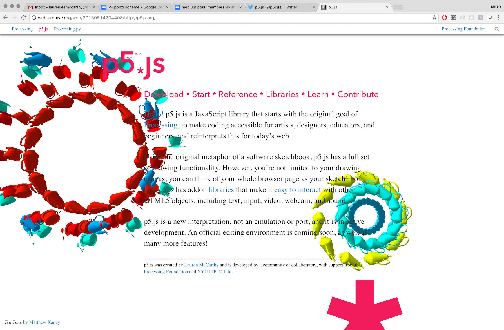

# P5.JS CODELAB
<!--
Software beïnvloedt alle aspecten van de hedendaagse beeldcultuur. Veel gevestigde kunstenaars hebben software geïntegreerd in hun proces. Ze gebruiken niet alleen software maar ze maken ook vaak software op maat om hun ideeën te realiseren.

Dit codelab is een beknopte kennismaking met het potentieel van code voor beeldend kunstenaars. Programmeren opent de mogelijkheid om, niet alleen handige tools te maken, maar ook om nieuwe vormen van expressie te vinden. Hier houdt de computer op een hulpmiddel te zijn en wordt het een medium.
-->
### WAT IS P5.JS?
> "With p5.js, you can think of your entire Web browser as your canvas for sketching with code!"

[p5.js](https://p5js.org/) is een JavaScript bibliotheek dat via code audio-visuele media op het web toegankelijk maakt. Het is een herinterpretatie van [Processing](https://processing.org/) voor het web en onderschrijft dezelfde doelen: een laagdrempelige instap tot programmeren voor beginners en tevens alle opties openhouden voor zeer krachtige en uitgebreide toepassingen. De ontwikkeling werd in 2013 gestart door Lauren McCarthy en groeide sindsdien in samenwerking met een grote gemeenschap onder de hoede van de Processing Foundation.

    

### WAAROM P5.JS?
1. Het is gratis, open source en cross-platform.
2. Het is ontworpen voor beginners, maar nog steeds erg robuust en uitbreidbaar.
3. Er is een enorme gemeenschap van mensen die p5.js gebruiken wat ervoor zorgt dat je makkelijk hulp kan vinden. (Computer nerds kunnen al eens hautain zijn. p5.js is gastvrijer dan veel andere omgevingen.)
4. De taalstructuur (syntax) is vergelijkbaar met andere talen.
5. p5.js *compileert* tot javascript. Veel van wat er mee leert is ook van toepassing op Javascript.
6. p5.js mission statement bevat inclusiviteit en toegangkelijkheid als het belangrijkste onderdeel van hun platform.

### INSPIRATIE
- [Casey Reas](http://reas.com/) • mede-oprichter Processing
- [Lauren Lee McCarthy](https://lauren-mccarthy.com/) • ontwerper van p5.js
- [p5.js 2020 Showcase](https://showcase.p5js.org/)
- [OpenProcessing](https://www.openprocessing.org/), een online platform gericht op het delen en bespreken van Processing / p5.js schetsen in een open-source omgeving
- [Generative Design / Gestaltung](http://www.generative-gestaltung.de/2/) Boek & website over generatieve kunst & design
- [LIA](http://www.liaworks.com/) • pionier op het gebied van software en nettokunst (actief sinds 1995)
- [Hamid Naderi Yeganeh](https://about.me/naderiyeganeh) • een Iraanse wiskundige en digitale kunstenaar

### PREPS
1. Bekijk [deze interactieve video]((http://hello.p5js.org/)) van Lauren McCarthy en Daniel Shiffman.
2. Lees de [p5.js Community Statement](https://p5js.org/community/).
3. Meld je aan voor een account op [de p5.js web editor](https://editor.p5js.org/)
4. En bekijk eventueel een aantal van [de p5.js voorbeelden]((https://p5js.org/examples/)) om vertrouwd te raken met de mogelijkheden

## TUTORIAL
👉 [P5.JS tutorial](https://github.com/theBlackBoxSociety/p5js) 👈
