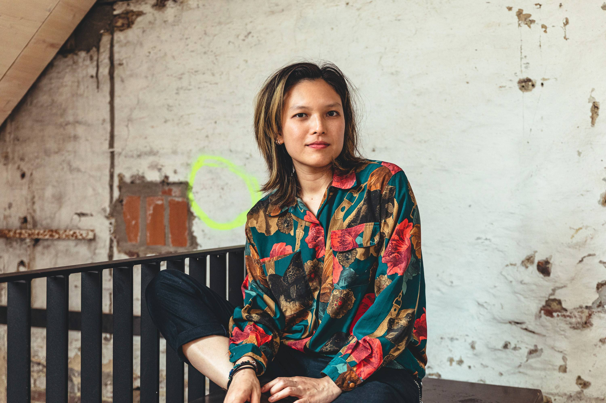

# GELUID IN DE KUNST / SOUND IN THE ARTS

Tijdens deze workshop met [Liew Niyomkarn](https://liewniyomkarn.com/) maak je kennis met het domein van geluidskunst en krijg je een hands-on introductie tot klank opname- en montagetechnieken.    
===
De workshop wordt in het Engels gegeven.     

Deelnemers zorgen zelf voor een geluidsopname toestel (eventueel te verkrijgen via de uitleendiensten), voldoende batterijen, de beste koptelefoon die je kan bemachtigen en een computer met [Reaper](https://www.reaper.fm/) geïnstalleerd.     

Inschrijven kan je via mail naar hendrik.leper-at-hogent.be. De workshop staat ook open voor studenten van andere opleidingen maar studenten mediakunst krijgen voorrang.

## Programma
#### Maandag 8 november 2021 van 10.00 - 17.00 uur
**10u - 12u30 @ atelier mediakunst**
- Inleiding tot geluidskunst en field recording
**14u - 17u @ Herculeslab**
- Luisteroefening
- Recorders en microfoons
- Opnametechnieken
- Soundscape opdracht

#### Dinsdag 9 november 2021 van 10u - 17u
**10 uur - 12.30 uur @ atelier mediakunst**
- Inleiding Editing & mixing basics met Reaper.
**14.00 - 17.00 uur @ atelier mediakunst**
- Concepten van interactieve geluidsinstallaties, acoustemologie, deep listening, live performance
- Werksessie soundscape (stuk van 5á8 minuten)

#### Woensdag 10 november 2021 van 10u - 17u
**10u - 12.30u @ atelier mediakunst**
- werk- en luistersessies
**14 - 15 uur @ atelier mediakunst**
- individuele gesprekken
**15.30 - 17.00 uur @ KASKcinema**
- Lezing door [Pauline Curnier Jardin](2021_paulinecurnierjardin)

## Liew Niyomkarn

[Liew Niyomkarn](https://liewniyomkarn.com/) is geluidskunstenaar en muzikant. Ze woont en werkt in Antwerpen. Haar werkdomein bevindt zich binnen de elektronische muziek, performance, geluidskunst en klank voor bewegend beeld. Haar werk werpt een kritische blik op de historische wortels van de geografie en verwijst vaak naar rituelen, overlevingstechnieken en akoestische ecologie. Ze maakt gebruik van gevonden objecten, field recordings, code, video, tekst, spoken word, … Deze elementen combineert ze met een rijk klankenpalet waarbij de fysieke eigenschappen van geluid zelf geïntegreerd worden.    

Liew heeft een MFA Calarts en Sonologie in Den Haag. Ze heeft opgetreden op verschillende plaatsen waaronder High Zero Festival (Baltimore), Studio Loos (Den Haag), WORM (Rotterdam), STUK (België), DAAD (Berlijn), The Wulf (Los Angeles), Toneelhuis (Antwerpen) en andere.     
Samen met Inne Eysermans is ze [Velma Spell](http://www.velmaspell.com/), een futuristische persona die een verscheidenheid aan muziek maakt en brengt, van impro, over ambient tot popmuziek.
