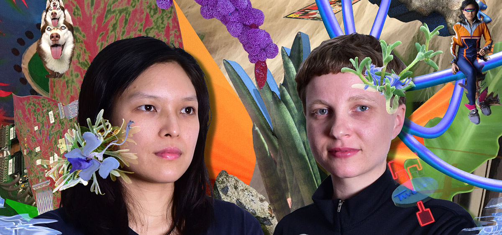
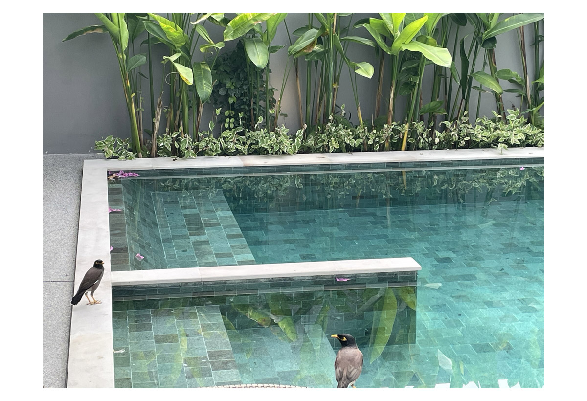

# GRAPHIC SCORES
#### workshop with Velma Spell
#### 24 & 25/03/2022 10:00 - 18:00
Under the persona, [Velma Spell](www.velmaspell.com), Liew Niyomkarn and Inne Eysermans create playful performances and audio essays. Velma Spell combines sound, music, text, objects, electronic devices, and environments. Possible narratives arise from the spatial composition in which the two workers animate a given space. Velma Spell draws inspiration from mythological to scientific approaches and documentary material.

Velma has shown at STUK (Constellation Walk, 2021), De Grote Post (North Sea, 2021), Gent Festival (Maria, 2020-2021), Middelheim Park (Outdoor Hiking, La Renaissance, 2021), De Nor, Blond, West Den Haag, etc.

    

[Liew Niyomkarn](https://liewniyomkarn.com/) is a sound artist and musician based in Antwerp. Her work focuses on listening practice and the conveyance of memories through sound. She uses field recordings to detect time, (non-)human's voices, everyday routines, text, archival sounds, and different tuning systems in nature -- to combine them with a sonic palette and the properties of sound itself such as sounds of spaces -- she presents her work in the form of live performance and sound installation.

Liew holds MFA Calarts and Sonology course in The Hague. Liew has performed in many various places such as High Zero Festival (Baltimore), Studio Loos (Den Haag), WORM (Rotterdam), STUK (Belgium), DAAD (Berlin), The Wulf (Los Angeles), Toneelhuis (Antwerp) and among other places.

Antwerp-based sound artist and musician [Inne Eysermans](https://www.inneeysermans.com/) creates musical performances and spatial compositions, often in combination with text and/or moving image and more recently within the World Wide Web. She has produced music and sound for film, theatre and radio/podcast. Her works encompass synthesis, resampling techniques, field recordings, found sound and objects. She is interested in interpreting, amplifying and transforming physical and virtual spaces which embeds instructed and spontaneous actions. Previously, in 2008, she formed the band Amatorski.

Inne studied Music Production at The Royal Conservatory of Ghent and EPAS at the School of Arts Gent. In 2017 she joined as a lecturer in sound/music at The Royal Conservatoire of Antwerp.

#### Thursday 24 & Friday 25 March 10:00 - 18:00,	Workshop @ Production studios
During a two-day workshop participants will explore how to read, write and perform graphic scores.

We’ll have a look at some contemporary scores and how to interpret them. We’ll also discuss ways to translate a musical sound, sounding spaces, gesture or a visual work into a score. How to make structure by using an index, symbols, and signs. Eventually, we will make a score ourselves and perform it.

Bring some objects, musical instruments, electronics, your favorite markers, stamps, stickers, etc. There will also be some materials provided to create your own score. No musical background is needed.

Sent an email to gert.jacobs[at]hogent.be & hendrik.leper[at]hogent.be to register.

In collaboration with [Music Production](https://schoolofartsgent.be/en/opleiding/bachelor-en-master-in-de-muziek/scheppende-muziek/muziekproductie/)
