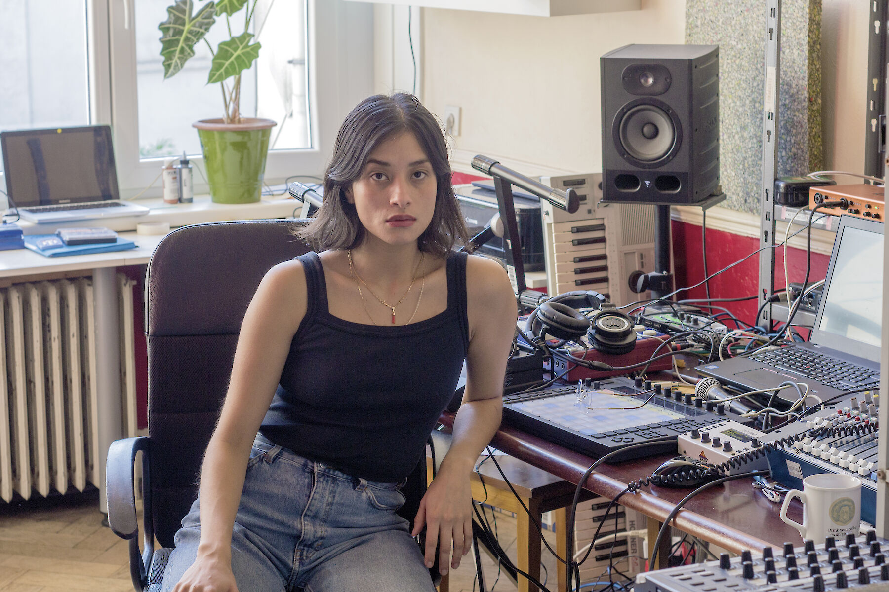
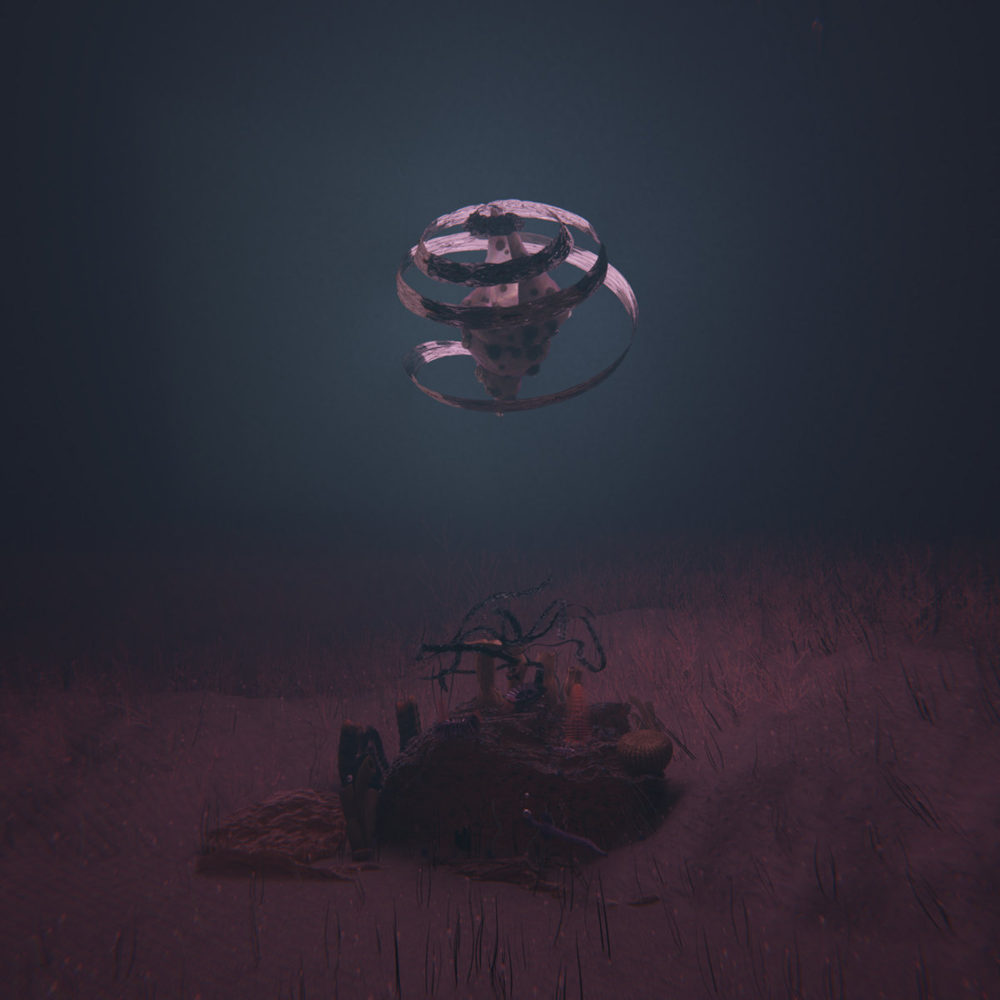
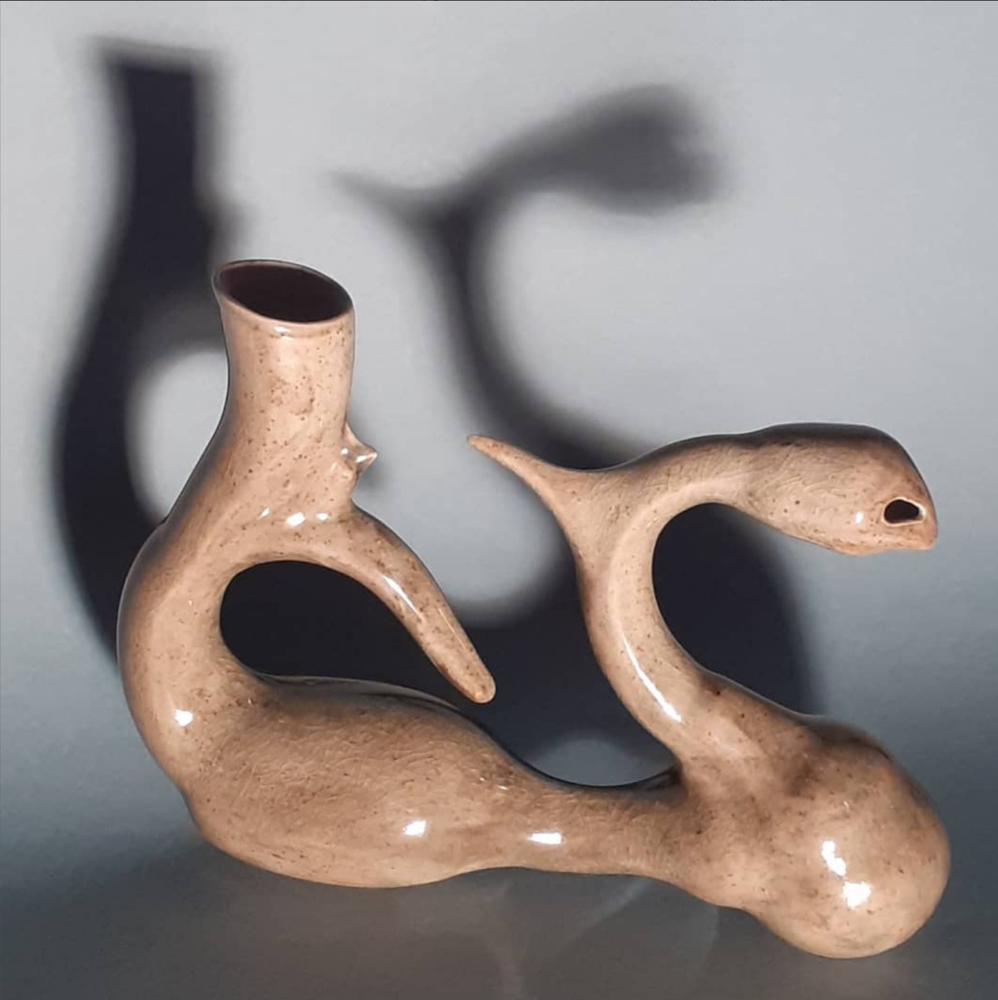

# VICA PACHECO
#### artist presentation & studiovisits
#### atelier MEDIAKUNST / KASK
#### vrijdag, 4 maart 2022, 10:30
Ana Victoria aka Vica Pacheco was born in Oaxaca, southern Mexico in 1993. She lives and works in Brussels.

Vica studied Art at La Esmeralda in México City before graduating from Villa Arson in 2017. Her artistic work is above all eclectic and energetic, regardless of her sources of inspiration and her concerns for mythological crossbreeding and sincretism, she likes to arrange the most heterogeneous or hazardous elements between them, to produce sound performances and installations . She has a practice rooted in music and sound art, but also a plastic practice going through ceramics and 3d animation.

[soundcloud.com/lilvica](https://soundcloud.com/lilvica) |
[instagram.com/la_vica_](https://www.instagram.com/la_vica_/)

#### 10:30-12:00	Artist Presentation
For an hour and a half, Vica takes us on a journey through het artistic practice, themes, processes, and ideals.
#### 13:30-17:00	Studiovisits
Engage with Vica in a one-on-one conversation about your work. Sign up through [this doodle](https://doodle.com/poll/hxgsmci7567rv5zv?utm_source=poll&utm_medium=link).

    

