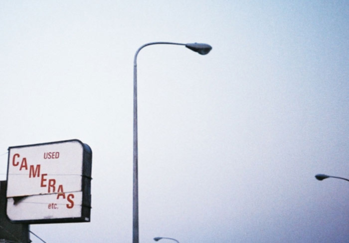

# VIDEO & FILM
#### dinsdag 03 & 17 nov, 1 dec 2020, 9:30-15:30
#### MS Teams
Fairuz is a visual enthusiast who lives and works in Vilvoorde.    
She graduated as an experimental filmmaker and works as an editor, cinematographer, filmmaker and teacher in cinema beyond genres and formats.
She equally loves well balanced high-def shots and user generated lo-fi trash as long as the poetry shines through.
Her debut short documentary Oumoun (2017) was shown at Courtisane, Doclisboa, Berwick Film & Media Arts Festival and EMAF where it won the Dialog-Preis.

