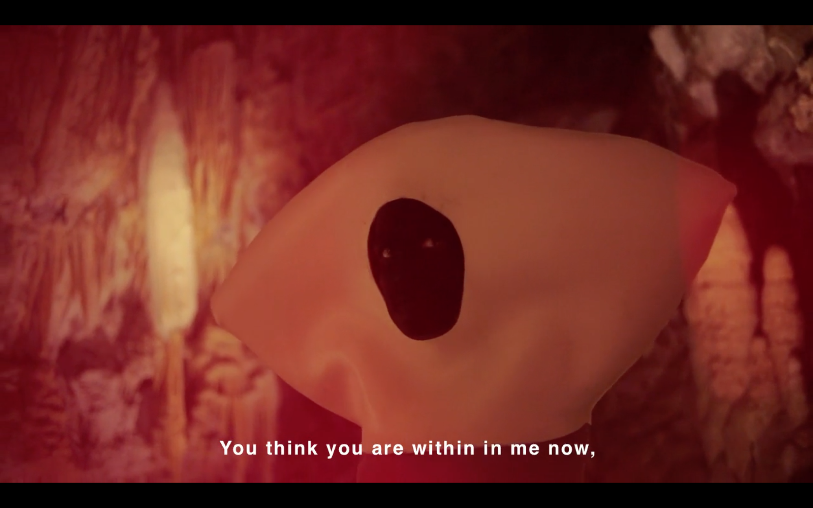

# X-RAY met PAULINE CURNIER JARDIN
### Unfolding the Practice & Screening
### @ KASKcinema
### woensdag 10 november, 2021, 20:30
<!--https://www.kaskcinema.be/kaskcinema/vertoning/x_ray_pauline_curnier_jardin-->

[Pauline Curnier Jardin](http://paulinecurnierjardin.com/) (geboren 1980, Marseille, Frankrijk) is een beeldend kunstenaar. Ze werkt voornamelijk met film, installatie, performance en tekenen. Ze woont in Rome en Berlijn.    

In haar werk onderzoekt Curnier Jardin iconische figuren, gebeurtenissen en plaatsen waaronder; Jeanne d'Arc, Bernadette Soubirous, de Godin Demeter, de geboorte van Jezus en zijn familie heiligen, het Anatomisch theater van de Renaissance maar ook  heidense en katholieke riten uit Centraal- en Zuid-Europa. Ze combineert hierin etnografie met fantasie en heeft een bijzondere aandacht van de rollen die vrouwen hebben gespeeld in de mythologie, folklore en de conventionele narratieve cinema; rollen die gewoonlijk worden gestereotypeerd als heilige, heks, moeder, ...

Tickets via KASKcinema.

### Unfolding the Practice - 10/11/2021, 15:30-17:30 - KASKcinema
Gedurende twee uur neemt Pauline je mee op een reis door haar artistieke carrière, thema's, processen en idealen. Deze intieme middag, alleen voor studenten, is een unieke kans om inzicht te krijgen in haar werk en leven, en met haar in dialoog te gaan.
