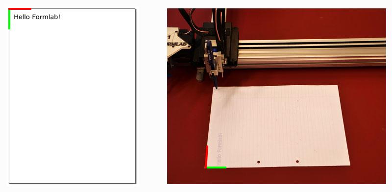

AXIDRAW
AXIDRAW V3/A3 – AN A3 PEN PLOTTER FROM EVIL MAD SCIENTIST HTTPS://WWW.AXIDRAW.COM/
## AXIDRAW USER GUIDE
https://wiki.evilmadscientist.com/AxiDraw_User_Guide
pdf version https://cdn.evilmadscientist.com/dl/ad/public/AxiDraw_Guide_v501b.pdf

## AXIDRAW WITH INKSCAPE
### AXIDRAW SOFTWARE INSTALLATION
See https://wiki.evilmadscientist.com/Axidraw_Software_Installation

### QUICK SETUP
1. Move the AxiDraw to its Home Corner.
2. Plug in power and USB cables.
3. Add the pen to the plotter.
4. Position your paper with its upper-left corner below the pen tip.
5. In Inkscape
  1. Select the drawing or text and select Path > Object to path.
  2. Extensions > AxiDraw Control. Go to tab setup. Click the Toggle pen between UP, DOWN option. Click apply to toggle the pen down and back up to check the correct vertical movement.
    1. Adjust the pen's height
    2. Try to keep the range of movement to a minimum. This will draw faster and is better for the servo motor.
  3. Extensions > AxiDraw Control. Go to tab Plot and click Apply to start plotting. Each visible layer will print.

Vertical documents in Inkscape will be rotated left 90° on the Axidraw:

For single line fonts, check Inkscape Extensions > text > Hershey text

## AXIDRAW WITHOUT INKSCAPE
AxiDraw Python API for plotting files and XY movement commands https://axidraw.com/doc/py_api/    
AxiDraw-Processing for driving the AxiDraw from within Processing https://github.com/evil-mad/AxiDraw-Processing

## BITMAP 2 VECTORS
Convert JPG, PNG images to SVG, PDF, EPS, AI
### IN ILLUSTRATOR
Step 1: Place Image in Illustrator.
Step 2: Select the image and Image Trace  (Object -> Image Trace) or open the Image Trace window.
Step 3: Try some presets. Remember that the plotter can only draw the outline (stroke) of a path it cannot fill a shape.
Step 4: Click expand to complete the Vectorization .

### IN INKSCAPE
Step 1: Open Image (png?) in Inkscape. Open image in Inkscape or drag an image onto your Inkscape document.
Step 2: Trace Bitmap (Path -> Trace Bitmap) Then, hover over Path in the top Inkscape toolbar and click on Trace Bitmap. ...
Step 3: Complete the Vectorization.

### Plotter Fun – a playground for plotter art
Different algorithms all collected in a Webapp by mixtela or Tim Alex Jacobs https://mitxela.com/plotterfun/
See https://mitxela.com/projects/plotting for more info

## DRAWING BY NUMBERS
### Turtle Graphics
turtle graphics are vector graphics using a relative cursor (the "turtle") upon a Cartesian plane (x and y axis).
The turtle has three attributes: a location, an orientation (or direction), and a pen. The pen, too, has attributes: color, width, and on/off state (also called down and up).
The turtle moves with commands that are relative to its own position, such as "move forward 10 spaces" and "turn left 90 degrees". The pen carried by the turtle can also be controlled, by enabling it, setting its color, or setting its width.
https://en.wikipedia.org/wiki/Turtle_graphics

A turtle graphics module for Python  https://docs.python.org/3/library/turtle.html
A minimalistic javascript Turtle graphics API https://turtletoy.net/

### P5JS
### Processing
### 

## READS & LINKS

https://www.generativehut.com/

Tobias Toft ‘An intro to Pen Plotters’ https://medium.com/quarterstudio/an-intro-to-pen-plotters-29b6bd4327ba
Matt DesLauriers ‘Pen Plotter Art & Algorithms‘ https://mattdesl.svbtle.com/pen-plotter-1
Michael Fogleman ‘Pen Plotter Programming: The Basics’ https://medium.com/@fogleman/pen-plotter-programming-the-basics-ec0407ab5929
Tyler Hobbs ‘9 Tips to Execute Generative Art with a Plotter’ https://tylerxhobbs.com/essays/2018/executing-generative-art-with-a-plotter
Anders Hoff ‘On Generative Algorithms’ https://inconvergent.net/generative/

## ART
Lia https://www.liaworks.com/tag/plotter-drawing/
Patrick Tresset https://patricktresset.com/new/
https://www.youtube.com/watch?v=gG_pzgfeESs
Manfred Mohr http://www.emohr.com/i
